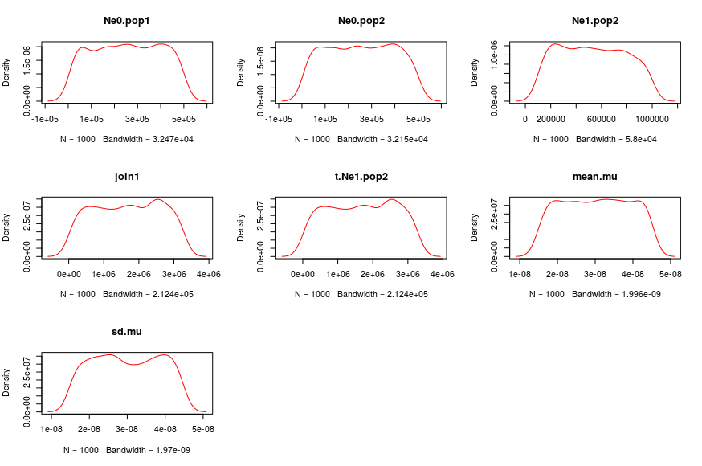
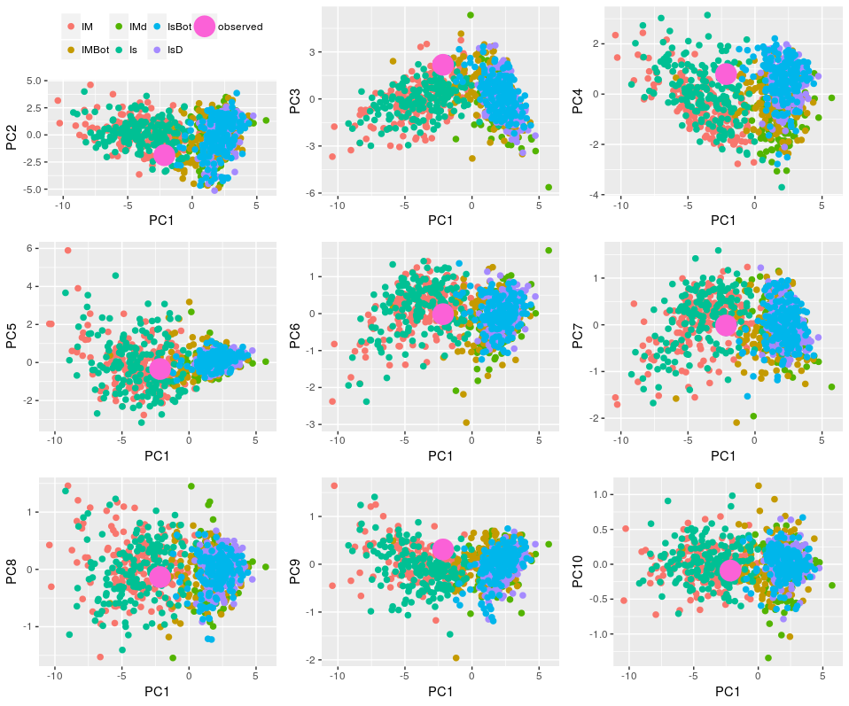

# Simulations and analyses with PipeMaster (sanger example)
  
  This is an R script showing how to simulate data, test model and estimate parameters using [PipeMaster](https://github/gehara/PipeMaster), abc and caret packages.
The data set used is the same as the one used in Gehara et al (in prep), and represents 5 loci for the snakes *Agkistrodon piscivorus* and *Agkistrodon contortrix*. For more information about these species see Gehara et al (in prep) and [Burbrink and Guiher 2015](https://www.researchgate.net/publication/269419564_Considering_gene_flow_when_using_coalescent_methods_to_delimit_lineages_of_North_American_pitvipers_of_the_genus_Agkistrodon)


### 1) Install and load all necessary packages

#### 1.1 instalation
```{r}
install.packages(c("devtools","ggplot2","abc","caret","doMC", "gridExtra"))

library(devtools) # devtools: necessary for PipeMaster instalation

install_github("gehara/PipeMaster@developing")
```

#### 1.2 load packages
```{r}
library(devtools)

library(PipeMaster) # PipeMaster: used to simulate data and some additional tools

library(abc) # abc: used to perform approximate Bayesian computation (ABC)

library(caret) # caret: used to perform the superevised machine-learning (SML)

library(doMC) # doMC: necessary to run the SML in parallel

library(ggplot2) # ggplot2: used to plot PCA

library(gridExtra) # to plot multiple plots in one figure
```

### 2) Create a working directory to save results

```{r}
# get the working directory
path <- getwd()

# create a new directory to save outputs
dir.create(paste(path,"/PM_example",sep=""))

# set working directory
setwd(paste(path,"/PM_example",sep=""))
```
# A - *Agkistrodon piscivorus* example data
### 3) Load example data
This example data is based on Gehara et al. 

```{r}
# models and observed summary statistics
data("A_piscivorus", package = "PipeMaster")
```

### 4) Usefull tips and tools

##### *dput* is usefull to save the loaded models in the working directory as .txt files

```{r}
dput(Is,"Is.txt")
dput(IsD,"IsD.txt")
dput(IsBot,"IsBot.txt")
dput(IM,"IM.txt")
dput(IMD,"IMD.txt")
dput(IMBot,"IMBot.txt")
```
##### You can use *dget* to retrieve models from .txt files saved with *dput*
```{r}
Is <- dget("Is.txt")
IM <- dget("IM.txt")
IsD <- dget("IsD.txt")
IMD <- dget("IMD.txt")
IsBot <- dget("IsBot.txt")
IMBot <- dget("IMBot.txt")
```

#### With the function bellow you can see the parameters and priors of the models

```{r}
tab <- get.prior.table(model=Is)
tab

   Parameter prior.1 prior.2 distribution
1   Ne0.pop1   10000   5e+05        runif
2   Ne0.pop2   10000   5e+05        runif
3   Ne1.pop2  100000   1e+06        runif
4 t.Ne1.pop2   33000 3300000        runif
5      join1   33000 3300000        runif
```


#### Visualize prior distributions

```{r}
plot.priors(Is)
```



```{r}
> tab <- get.prior.table(model=Is)
> tab

   Parameter prior.1 prior.2 distribution
1   Ne0.pop1   10000   5e+05        runif
2   Ne0.pop2   10000   5e+05        runif
3   Ne1.pop2  100000   1e+06        runif
4 t.Ne1.pop2   33000 3300000        runif
5      join1   33000 3300000        runif
```

```{r}
> tab[,2:3] <- 1000
> tab

   Parameter prior.1 prior.2 distribution
1   Ne0.pop1    1000    1000        runif
2   Ne0.pop2    1000    1000        runif
3   Ne1.pop2    1000    1000        runif
4 t.Ne1.pop2    1000    1000        runif
5      join1    1000    1000        runif
```

```{r}
> Is2 <- update.priors(tab = tab, model = Is)
> get.prior.table(model=Is2)

   Parameter prior.1 prior.2 distribution
1   Ne0.pop1    1000    1000        runif
2   Ne0.pop2    1000    1000        runif
3   Ne1.pop2    1000    1000        runif
4 t.Ne1.pop2    1000    1000        runif
5      join1    1000    1000        runif
```

### 5) Simulate data for all 6 models. 
```{r}
sim.ms.sumstat(Is, nsim.blocks = 5, use.alpha = F, output.name = "Is", append.sims = F, get.moments = F)

sim.ms.sumstat(IM, nsim.blocks = 5, use.alpha = F, output.name = "IM", append.sims = F, get.moments = F)

sim.ms.sumstat(IsD, nsim.blocks = 5, use.alpha = c(T,1,2), output.name = "IsD", append.sims = F, get.moments = F)

sim.ms.sumstat(IMD, nsim.blocks = 50, use.alpha = c(T,1,2), output.name = "IMD", append.sims = F, get.moments = F)

sim.ms.sumstat(IsBot, nsim.blocks = 5, use.alpha = c(T,1,2), output.name = "IsBot", append.sims = F, get.moments = F)

sim.ms.sumstat(IMBot, nsim.blocks = 5, use.alpha = c(T,1,2), output.name = "IMBot", append.sims = F, get.moments = F)
```

#### For more information about the function
```{r}
?sim.ms.sumstat()
```

### 6) Read simulations
```{r}

Is.sim <- read.table("Is_popstats_mean.txt", header=T)
Is.sim <- cbind(Is.sim,read.table("Is_overallstats_mean.txt", header=T)[,1:3])

IM.sim <- read.table("IM_popstats_mean.txt", header=T)
IM.sim <- cbind(IM.sim,read.table("IM_overallstats_mean.txt", header=T)[,1:3])

IsD.sim <- read.table("IsD_popstats_mean.txt", header=T)
IsD.sim <- cbind(IsD.sim,read.table("IsD_overallstats_mean.txt", header=T)[,1:3])

IMD.sim <- read.table("IMD_popstats_mean.txt", header=T)
IMD.sim <- cbind(IMD.sim,read.table("IMD_overallstats_mean.txt", header=T)[,1:3])

IsBot.sim <- read.table("IsBot_popstats_mean.txt", header=T)
IsBot.sim <- cbind(IsBot.sim,read.table("IsBot_overallstats_mean.txt", header=T)[,1:3])

IMBot.sim <- read.table("IMBot_popstats_mean.txt", header=T)
IMBot.sim <- cbind(IMBot.sim, read.table("IMBot_overallstats_mean.txt", header=T)[,1:3])
```

### 7) to calculate the observed in your own data you should run the function bellow. The observed for this dataset is  already available as part of the package.

```{R}
# observed.sumstat(Is, path.to.fasta = "",get.moments = T)

observed <- read.table("observed_popstats_mean.txt",header=T)
observed <- cbind(observed,read.table("observed_overallstats_mean.txt",header=T)[1:3])

```

### 8) See and select summary stats

```{r}
#### see sumstats names

colnames(observed)

 [1] "ss.pop1_mean"    "ss.pop2_mean"    "pi.pop1_mean"    "pi.pop2_mean"    "H.pop1_mean"     "H.pop2_mean"    
 [7] "TajD.pop1_mean"  "TajD.pop2_mean"  "FuLiD.pop1_mean" "FuLiD.pop2_mean" "FuLiF.pop1_mean" "FuLiF.pop2_mean"
[13] "Hap.Fst_mean"    "nuc.Fst_mean"    "s.sites_mean"    "pi_mean"         "Hap.div_mean"   
```

#### 9) Plot PCA
##### define function to perform PCA
```{r}
plotPCs <- function (models, data) {
  # exclude missing data for pca plot
  data.PCA <- data[complete.cases(models)]
  models.PCA <- models[complete.cases(models),]
  # subsample for PCA
  x <- createDataPartition(data.PCA, p = 1000/nrow(models.PCA), list = FALSE, times = 1)
  data.PCA <- data.PCA[x]
  models.PCA <- models.PCA[x,]
  # run PCA
  PCA <- prcomp(rbind(models.PCA, observed), center = T, scale. = T, retx=T)
  # get scores
  scores <- data.frame(PCA$x[,1:ncol(PCA$x)])
  PC <- colnames(scores)[1:10]
  plotPCA<-function(PCS){
    PCS <- sym(PCS)
    p <- ggplot(scores, aes(x = PC1, y = !! PCS ))+
      theme(legend.position = "none")+
      geom_point(aes(colour=c(data.PCA,"observed"), size=c(data.PCA,"observed")))+
      scale_shape_manual(values=19)+
      scale_size_manual(values=c(2,2,2,2,2,2,8))+
      if(PCS=="PC2") theme(legend.position="top", legend.direction="horizontal", legend.title = element_blank())
    return(p)
  }
  P <- NULL
  for(i in 2:10){
    P[[i]]  <- plotPCA(PC[i])
  }
  grid.arrange(P[[2]], P[[3]], P[[4]], P[[5]], P[[6]], P[[7]], P[[8]], P[[9]], P[[10]],nrow=3)
}
```
##### combine models and plot PCA

```{r}
models <- rbind(IM.sim,
                IMD.sim,
                IMBot.sim,
                Is.sim,
                IsD.sim,
                IsBot.sim)

data <- c(rep("IM", nrow(IM.sim)),
          rep("IMd", nrow(IMD.sim)),
          rep("IMBot", nrow(IMBot.sim)),
          rep("Is", nrow(Is.sim)),
          rep("IsD", nrow(IsD.sim)),
          rep("IsBot", nrow(IsBot.sim)))

plotPCs(models, data)
```


### 10) Define functions to perform analysis

#### 10.1) ABC analysis with cross-validadion. You may also run each of the internal functions separately.

```{r}
abc.test <- function(model, data, observed){
  
  # here I'm using a tolerance proportion of 0.001 with a rejection algorithm
  x <- postpr(observed, index = data, sumstat = models, tol = 0.001, method =        "rejection")
  
  # save results in "x"
  x <- summary(x)
  
  # run a cross-validation with the same tolerance and rejection method with 100 validations
  y <- cv4postpr(index = data, sumstat = models, tols = 0.001,method = "rejection", nval = 100, trace = T)
  
  # save results in "y"
  y <- summary(y)
  
  # combine everything in a table
  table <- c(x$Prob, sum(diag(as.matrix(y$conf.matrix)[[1]]))/sum(as.matrix(y$conf.matrix)[[1]]))
  
  # return table
  return(table)
}
```

#### 10.2) Supervised machine-learning (SML) analysis, trainning and testing. You may also run each of the internal functions separately.

```{r}
train.test <- function(models, data, observed){
  
  # combine model and index
  models <- cbind(models, data)
  # define outcome
  outcomeName <- 'data'
  #define predictors
  predictorsNames <- names(models)[names(models) != outcomeName]
  
  # split the simulations into traning (75%) and testing (25%)
  splitIndex <- createDataPartition(models[,outcomeName], p = .75, list = FALSE, times = 1)
  train <- models[ splitIndex,]
  test  <- models[-splitIndex,]
  
  # define parameters of algorithm traning
  objControl <- trainControl(method='boot', number=50, returnResamp='final', 
                             classProbs = TRUE)
  
  # train the algorithm
  nnetModel <- train(train[,predictorsNames], train[,outcomeName],
                     method="nnet",maxit=2000, 
                     trControl=objControl,  
                     metric = "Accuracy",
                     preProc = c("range"))
  
  # calculate acuracy, test if traning went well
  predictions <- predict(object=nnetModel, test[,predictorsNames], type='raw')
  accu <- postResample(pred=predictions, obs=as.factor(test[,outcomeName]))
  
  # predict outcome of the observed data
  pred <- predict(object=nnetModel, observed, type='prob')
  
  # combine results in a table
  table <- c(pred, accu)
  return(table)
}
```

#### 10.3) Run the analysis. I am comparing models hierarchicaly. First comparing pairs of models, then the best of the three first comparisons.
#### First comparisons:

```{r}
  ### combine models
  models <- rbind(Is.sim, IM.sim)
  ## index of models
  data <- c(rep("Is", nrow(Is.sim)),
            rep("IM", nrow(IM.sim)))
  
  # run SML
  nn.res <- train.test(models, data, observed)
  # run ABC
  abc.res <- abc.test(models, data, observed)
  
  ####################################
  ### combine models
  models<-rbind(IsD.sim,IMD.sim)
  # index of models
  data<-c(rep("IsD",nrow(IsD.sim)),
          rep("IMD",nrow(IMD.sim)))
  
  # run SML and combine results
  nn.res <- rbind(nn.res, train.test(models, data, observed))
  # run ABC and combine results
  abc.res <- rbind(abc.res, abc.test(models, data, observed))
  
  ###############################
  ### combine models
  models <- rbind(IsBot.sim, IMBot.sim)
  # index of models
  data <- c(rep("IsBot", nrow(IsBot.sim)),
            rep("IMBot", nrow(IMBot.sim)))
  
  # run SML and combine results
  nn.res <- rbind(nn.res, train.test(models, data, observed))
  # run ABC and combine results
  abc.res <- rbind(abc.res, abc.test(models, data, observed))
  
  # define column names
  rownames(nn.res) <- c("IMIS","Exp","Bott")
  rownames(abc.res) <- c("IMIS","Exp","Bott")
  
  # write results to file
  write.table(nn.res, paste("Results_SML_.txt",sep=""), quote = F, row.names = T, col.names = T)
  write.table(abc.res, paste("Results_ABC_rejection_.txt",sep=""), quote = F, row.names = T, col.names = T)
  
```  
#### Final comparison, best three models from the previous comparisons:

```{r}
  ### combine models
  models <- rbind(Is.sim,
                  IMD.sim,
                  IMBot.sim)
  
  # Index of models
  data <- c(rep("Is", nrow(IM.sim)),
            rep("IMD", nrow(IMD.sim)),
            rep("IMBot", nrow(IMBot.sim)))
  
  # run SML
  nn.res <- train.test(models, data, observed)
  # run ABC
  abc.res <- abc.test(models, data, observed)
  
  # write result to file
  write.table(nn.res, paste("Results_SML_final_comparison.txt",sep=""), quote = F, row.names = T, col.names = T)
  write.table(abc.res, paste("Results_ABC_rejection_final_comparison.txt",sep=""), quote = F, row.names = T, col.names = T)
```  

# *Agkistrodon contortrix* example data
### 11) Load example data
This example data is based on Gehara et al. 

```{r}
# models and observed summary statistics
data("A_contortrix", package = "PipeMaster")
```

### 12) Simulate data for all 6 models. 
```{r}
sim.ms.sumstat(Is, nsim.blocks = 5, use.alpha = F, output.name = "Is", append.sims = F, get.moments = F)

sim.ms.sumstat(IM, nsim.blocks = 5, use.alpha = F, output.name = "IM", append.sims = F, get.moments = F)

sim.ms.sumstat(IsD, nsim.blocks = 5, use.alpha = c(T,1,2), output.name = "IsD", append.sims = F, get.moments = F)

sim.ms.sumstat(IMD, nsim.blocks = 50, use.alpha = c(T,1,2), output.name = "IMD", append.sims = F, get.moments = F)

sim.ms.sumstat(IsBot, nsim.blocks = 5, use.alpha = c(T,1,2), output.name = "IsBot", append.sims = F, get.moments = F)

sim.ms.sumstat(IMBot, nsim.blocks = 5, use.alpha = c(T,1,2), output.name = "IMBot", append.sims = F, get.moments = F)
```

### 13) Read simulations
```{r}

Is.sim <- read.table("Is_popstats_mean.txt", header=T)
Is.sim <- cbind(Is.sim,read.table("Is_overallstats_mean.txt", header=T)[,1:3])

IM.sim <- read.table("IM_popstats_mean.txt", header=T)
IM.sim <- cbind(IM.sim,read.table("IM_overallstats_mean.txt", header=T)[,1:3])

IsD.sim <- read.table("IsD_popstats_mean.txt", header=T)
IsD.sim <- cbind(IsD.sim,read.table("IsD_overallstats_mean.txt", header=T)[,1:3])

IMD.sim <- read.table("IMD_popstats_mean.txt", header=T)
IMD.sim <- cbind(IMD.sim,read.table("IMD_overallstats_mean.txt", header=T)[,1:3])

IsBot.sim <- read.table("IsBot_popstats_mean.txt", header=T)
IsBot.sim <- cbind(IsBot.sim,read.table("IsBot_overallstats_mean.txt", header=T)[,1:3])

IMBot.sim <- read.table("IMBot_popstats_mean.txt", header=T)
IMBot.sim <- cbind(IMBot.sim, read.table("IMBot_overallstats_mean.txt", header=T)[,1:3])
```

#### 14) Plot PCA
##### define function to perform PCA
```{r}
plotPCs <- function (models, data) {
  # exclude missing data for pca plot
  data.PCA <- data[complete.cases(models)]
  models.PCA <- models[complete.cases(models),]
  # subsample for PCA
  x <- createDataPartition(data.PCA, p = 1000/nrow(models.PCA), list = FALSE, times = 1)
  data.PCA <- data.PCA[x]
  models.PCA <- models.PCA[x,]
  # run PCA
  PCA <- prcomp(rbind(models.PCA, observed), center = T, scale. = T, retx=T)
  # get scores
  scores <- data.frame(PCA$x[,1:ncol(PCA$x)])
  PC <- colnames(scores)[1:10]
  plotPCA<-function(PCS){
    PCS <- sym(PCS)
    p <- ggplot(scores, aes(x = PC1, y = !! PCS ))+
      theme(legend.position = "none")+
      geom_point(aes(colour=c(data.PCA,"observed"), size=c(data.PCA,"observed")))+
      scale_shape_manual(values=19)+
      scale_size_manual(values=c(2,2,2,2,2,2,8))+
      if(PCS=="PC2") theme(legend.position="top", legend.direction="horizontal", legend.title = element_blank())
    return(p)
  }
  P <- NULL
  for(i in 2:10){
    P[[i]]  <- plotPCA(PC[i])
  }
  grid.arrange(P[[2]], P[[3]], P[[4]], P[[5]], P[[6]], P[[7]], P[[8]], P[[9]], P[[10]],nrow=3)
}
```
##### combine models and plot PCA

```{r}
models <- rbind(IM.sim,
                IMD.sim,
                IMBot.sim,
                Is.sim,
                IsD.sim,
                IsBot.sim)

data <- c(rep("IM", nrow(IM.sim)),
          rep("IMd", nrow(IMD.sim)),
          rep("IMBot", nrow(IMBot.sim)),
          rep("Is", nrow(Is.sim)),
          rep("IsD", nrow(IsD.sim)),
          rep("IsBot", nrow(IsBot.sim)))

plotPCs(models, data)
```


#### 15) to perform the analysis run step 10.
