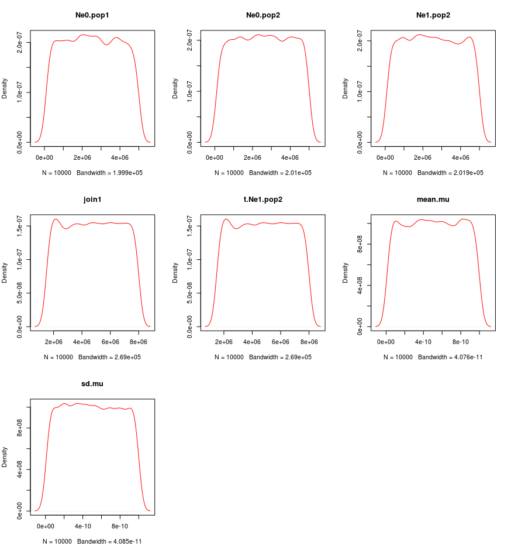
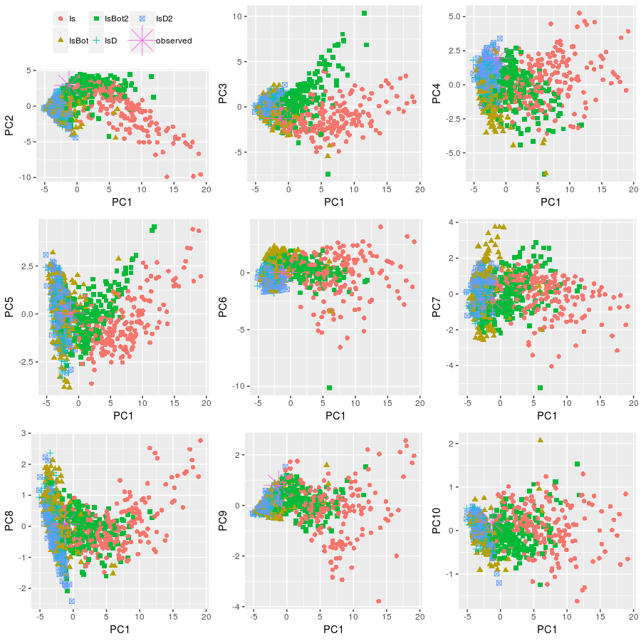
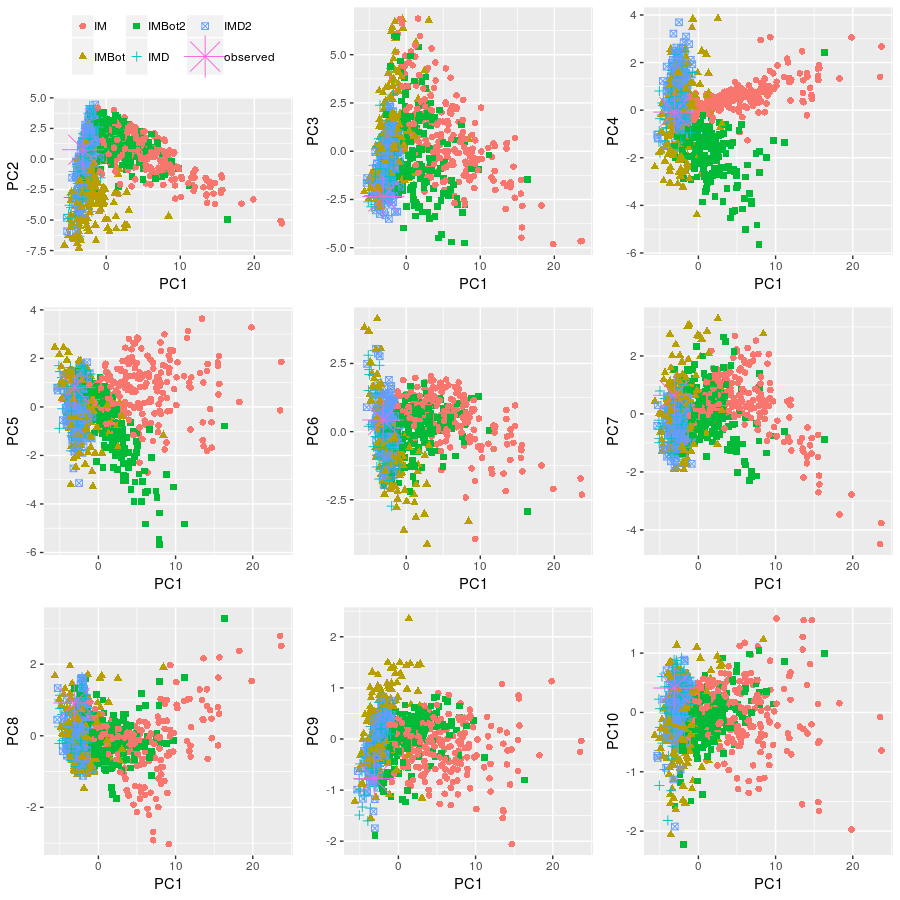

# Simulations and analyses with PipeMaster (nextgen example)

This is a script showing how to simulate data, test model and estimate parameters using [PipeMaster](https://github/gehara/PipeMaster), abc and caret packages.
The data set used is the same as the one used in Gehara et al (in prep), and represents 2177 UCE loci for the neotropical frog Dermatonotus muelleri. For more information about this species see Gehara et al (in prep). and [Oliveira et al. 2018](https://www.researchgate.net/profile/Adrian_Garda/publication/327624820_Phylogeography_of_Muller%27s_termite_frog_suggests_the_vicariant_role_of_the_Central_Brazilian_Plateau/links/5c40f99f92851c22a37d572c/Phylogeography-of-Mullers-termite-frog-suggests-the-vicariant-role-of-the-Central-Brazilian-Plateau.pdf)


### 1) Install and load all necessary packages

#### 1.1 instalation
```{r}
 install.packages(c("devtools","ggplot2","abc","caret","doMC"))

 library(devtools) # devtools: necessary for PipeMaster instalation

 install_github("gehara/PipeMaster@developing")
```

#### 1.2 load packages
```{r}
 library(devtools)

 library(PipeMaster) # PipeMaster: used to simulate data and some additional tools

 library(abc) # abc: used to perform approximate Bayesian computation (ABC)

 library(caret) # caret: used to perform the superevised machine-learning (SML)

 library(doMC) # doMC: necessary to run the SML in parallel

 library(ggplot2) # ggplot2: used to plot PCA
```

### 2) Create a working directory to save results

```{r}
 # get the working directory
 path <- getwd()
 
 # create a new directory to save outputs
 dir.create(paste(path,"/PM_example",sep=""))
 
 # set working directory
 setwd(paste(path,"/PM_example",sep=""))
```
### 3) Load example data
This example data is based on Gehara et al. 

```{r}
# observed summary statistics
data("observed_Dermatonotus", package = "PipeMaster")

# models used in Gehara et al
data("models", package="PipeMaster")
```

### 4) Usefull tips and tools

##### *dput* is usefull to save the loaded models in the working directory as .txt files

```{r}
dput(Is,"Is.txt")
dput(IsBot,"IsBot.txt")
dput(IsBot2,"IsBot2.txt")
dput(IsD,"IsD.txt")
dput(IsD2,"IsD2.txt")
dput(IM,"IM.txt")
dput(IMBot2,"IMBot2.txt")
dput(IMD2,"IMD2.txt")
dput(IMD,"IMD.txt")
dput(IMBot,"IMBot.txt")
```
##### You can use *dget* to retrieve models from .txt files saved with *dput*
```{r}
Is<-dget("Is.txt")
IM<-dget("IM.txt")
IsD<-dget("IsD.txt")
IMD<-dget("IMD.txt")
IsBot<-dget("IsBot.txt")
IMBot<-dget("IMBot.txt")
IsBot2<-dget("IsBot2.txt")
IMBot2<-dget("IMBot2.txt")
IsD2<-dget("IsD.txt")
IMD2<-dget("IMD.txt")
```
#### With the function bellow you can see the parameters and priors of the models

```{r}
tab <- get.prior.table(model=Is)
tab

   Parameter prior.1 prior.2 distribution
1   Ne0.pop1  100000 5000000        runif
2   Ne0.pop2  100000 5000000        runif
3   Ne1.pop2  100000 5000000        runif
4 t.Ne1.pop2 1500000 8000000        runif
5      join1 1500000 8000000        runif
```

#### Visualize prior distributions

```{r}
plot.priors(Is)
```


#### 4.5) it is possible to update the priors using the table

```{r}
> tab <- get.prior.table(model=Is)
> tab

   Parameter prior.1 prior.2 distribution
1   Ne0.pop1  100000 5000000        runif
2   Ne0.pop2  100000 5000000        runif
3   Ne1.pop2  100000 5000000        runif
4 t.Ne1.pop2 1500000 8000000        runif
5      join1 1500000 8000000        runif
```

```{r}
> tab[,2:3] <- 1000
> tab

   Parameter prior.1 prior.2 distribution
1   Ne0.pop1    1000    1000        runif
2   Ne0.pop2    1000    1000        runif
3   Ne1.pop2    1000    1000        runif
4 t.Ne1.pop2    1000    1000        runif
5      join1    1000    1000        runif
```

```{r}
> Is2 <- update.priors(tab = tab, model = Is)
> get.prior.table(model=Is2)

   Parameter prior.1 prior.2 distribution
1   Ne0.pop1    1000    1000        runif
2   Ne0.pop2    1000    1000        runif
3   Ne1.pop2    1000    1000        runif
4 t.Ne1.pop2    1000    1000        runif
5      join1    1000    1000        runif
```

### 5) Simulate data for all 10 models

```{r}
sim.msABC.sumstat(Is, nsim.blocks = 1, use.alpha = F, output.name = "Is", append.sims = F, block.size = 500, ncores = 2)

sim.msABC.sumstat(IM, nsim.blocks = 1, use.alpha = F, output.name = "IM", append.sims = F, block.size = 500, ncores = 2)

sim.msABC.sumstat(IsD, nsim.blocks = 1, use.alpha = c(T,1,2), output.name = "IsD", append.sims = F, block.size = 500, ncores = 2)

sim.msABC.sumstat(IMD, nsim.blocks = 1, use.alpha = c(T,1,2), output.name = "IMD", append.sims = F, block.size = 500, ncores = 2)

sim.msABC.sumstat(IsBot, nsim.blocks = 1, use.alpha = c(T,1,2), output.name = "IsBot", append.sims = F, block.size = 500, ncores = 2)

sim.msABC.sumstat(IMBot, nsim.blocks = 1, use.alpha = c(T,1,2), output.name = "IMBot", append.sims = F, block.size = 500, ncores = 2)

sim.msABC.sumstat(IsBot2, nsim.blocks = 1, use.alpha = c(T,1), output.name = "IsBot2", append.sims = F, block.size = 500, ncores = 2)

sim.msABC.sumstat(IMBot2, nsim.blocks = 1, use.alpha = c(T,1), output.name = "IMBot2", append.sims = F, block.size = 500, ncores = 2)

sim.msABC.sumstat(IsD2, nsim.blocks = 1, use.alpha = c(T,1), output.name = "IsD2", append.sims = F, block.size = 500, ncores = 2)

sim.msABC.sumstat(IMD2, nsim.blocks = 1, use.alpha = c(T,1), output.name = "IMD2", append.sims = F, block.size = 500, ncores = 2)
```
### 6) Read simulations

```{r}
  Is.sim <- read.table("SIMS_Is.txt", header=T)
  IM.sim <- read.table("SIMS_IM.txt", header=T)
  IsD.sim <- read.table("SIMS_IsD.txt", header=T)
  IMD.sim <- read.table("SIMS_IMD.txt", header=T)
  IsD2.sim <- read.table("SIMS_IsD2.txt", header=T)
  IMD2.sim <- read.table("SIMS_IMD2.txt", header=T)
  IsBot.sim <- read.table("SIMS_IsBot.txt", header=T)
  IMBot.sim <- read.table("SIMS_IMBot.txt", header=T)
  IsBot2.sim <- read.table("SIMS_IsBot2.txt", header=T)
  IMBot2.sim <- read.table("SIMS_IMBot2.txt", header=T)
```

### 7) See and select summary stats

```{r}
#### see sumstats names

colnames(observed)

[1] "s_average_segs_1"               "s_variance_segs_1"             
 [3] "s_average_segs_2"               "s_variance_segs_2"             
 [5] "s_average_segs"                 "s_variance_segs"               
 [7] "s_average_pi_1"                 "s_variance_pi_1"               
 [9] "s_average_pi_2"                 "s_variance_pi_2"               
[11] "s_average_pi"                   "s_variance_pi"                 
[13] "s_average_w_1"                  "s_variance_w_1"                
[15] "s_average_w_2"                  "s_variance_w_2"                
[17] "s_average_w"                    "s_variance_w"                  
[19] "s_average_tajd_1"               "s_variance_tajd_1"             
[21] "s_average_tajd_2"               "s_variance_tajd_2"             
[23] "s_average_tajd"                 "s_variance_tajd"               
[25] "s_average_ZnS_1"                "s_variance_ZnS_1"              
[27] "s_average_ZnS_2"                "s_variance_ZnS_2"              
[29] "s_average_ZnS"                  "s_variance_ZnS"                
[31] "s_average_Fst"                  "s_variance_Fst"                
[33] "s_average_shared_1_2"           "s_variance_shared_1_2"         
[35] "s_average_private_1_2"          "s_variance_private_1_2"        
[37] "s_average_fixed_dif_1_2"        "s_variance_fixed_dif_1_2"      
[39] "s_average_pairwise_fst_1_2"     "s_variance_pairwise_fst_1_2"   
[41] "s_average_fwh_1"                "s_variance_fwh_1"              
[43] "s_average_fwh_2"                "s_variance_fwh_2"              
[45] "s_average_FayWuH"               "s_variance_FayWuH"             
[47] "s_average_dvk_1"                "s_variance_dvk_1"              
[49] "s_average_dvh_1"                "s_variance_dvh_1"              
[51] "s_average_dvk_2"                "s_variance_dvk_2"              
[53] "s_average_dvh_2"                "s_variance_dvh_2"              
[55] "s_average_dvk"                  "s_variance_dvk"                
[57] "s_average_dvh"                  "s_variance_dvh"                
[59] "s_average_thomson_est_1"        "s_variance_thomson_est_1"      
[61] "s_average_thomson_est_2"        "s_variance_thomson_est_2"      
[63] "s_average_thomson_est"          "s_variance_thomson_est"        
[65] "s_average_thomson_var_1"        "s_variance_thomson_var_1"      
[67] "s_average_thomson_var_2"        "s_variance_thomson_var_2"      
[69] "s_average_thomson_var"          "s_variance_thomson_var"        
[71] "s_average_pi_1_s_average_w_1"   "s_variance_pi_1_s_variance_w_1"
[73] "s_average_pi_2_s_average_w_2"   "s_variance_pi_2_s_variance_w_2"
[75] "s_average_pi_s_average_w"       "s_variance_pi_s_variance_w"    
```

```{r}
#### select summary stats to be excluded using grep
cols <- c(grep("thomson", names(observed)),
          grep("pairwise_fst", names(observed)),
          grep("Fay", names(observed)),
          grep("fwh", names(observed)),
          grep("_dv", names(observed)),
          grep("_s_", names(observed)),
          grep("_ZnS_", names(observed)))

#### exclude
observed <- observed[,-cols]

#### visualize sumary stats names aggain
colnames(observed)

 [1] "s_average_segs_1"         "s_variance_segs_1"        "s_average_segs_2"        
 [4] "s_variance_segs_2"        "s_average_segs"           "s_variance_segs"         
 [7] "s_average_pi_1"           "s_variance_pi_1"          "s_average_pi_2"          
[10] "s_variance_pi_2"          "s_average_pi"             "s_variance_pi"           
[13] "s_average_w_1"            "s_variance_w_1"           "s_average_w_2"           
[16] "s_variance_w_2"           "s_average_w"              "s_variance_w"            
[19] "s_average_tajd_1"         "s_variance_tajd_1"        "s_average_tajd_2"        
[22] "s_variance_tajd_2"        "s_average_tajd"           "s_variance_tajd"         
[25] "s_average_ZnS"            "s_variance_ZnS"           "s_average_Fst"           
[28] "s_variance_Fst"           "s_average_shared_1_2"     "s_variance_shared_1_2"   
[31] "s_average_private_1_2"    "s_variance_private_1_2"   "s_average_fixed_dif_1_2" 
[34] "s_variance_fixed_dif_1_2"
```

### 8) combine simulations in a single matrix matching the summary stats names in the observed and run a Principal Components Analyses to visualize model-fit

```{r}
models <- rbind(Is.sim[,colnames(Is.sim) %in% colnames(observed)],
                IsD.sim[,colnames(IsD.sim) %in% colnames(observed)],
                IsD2.sim[,colnames(IsD2.sim) %in% colnames(observed)],
                IsBot.sim[,colnames(IsBot.sim) %in% colnames(observed)],
                IsBot2.sim[,colnames(IsBot2.sim) %in% colnames(observed)])

# create an index for the models
data <- c(rep("Is", nrow(Is.sim)),
         rep("IsD", nrow(IsD.sim)),
         rep("IsD2", nrow(IsD2.sim)),
         rep("IsBot", nrow(IsBot.sim)),
         rep("IsBot2", nrow(IsBot2.sim)))
```
```{r}
## plotPCs function
plotPCs <- function (models, data) {
    # exclude missing data for pca plot
    data.PCA <- data[complete.cases(models)]
    models.PCA <- models[complete.cases(models),]
    # subsample for PCA
    x <- sample(1:length(data.PCA),1000)
    data.PCA <- data.PCA[x]
    models.PCA <- models.PCA[x,]
    # run PCA
    PCA <- prcomp(rbind(models.PCA, observed), center = T, scale. = T, retx=T)
    # get scores
    scores <- data.frame(PCA$x[,1:ncol(PCA$x)])
    PC <- colnames(scores)[1:10]
    plotPCA<-function(PCS){
    PCS <- sym(PCS)
    p <- ggplot(scores, aes(x = PC1, y = !! PCS ))+
                theme(legend.position = "none")+
                geom_point(aes(colour=c(data.PCA,"observed"), size=c(data.PCA,"observed"),                    shape=c(data.PCA,"observed")))+
                scale_size_manual(values=c(2,2,2,2,2,10))+
                if(PCS=="PC2") theme(legend.position="top", legend.direction="horizontal",                    legend.title = element_blank())
    return(p)
    }
  P<-NULL
  for(i in 2:10){
  P[[i]]  <- plotPCA(PC[i])
  }
  grid.arrange(P[[2]], P[[3]], P[[4]], P[[5]], P[[6]], P[[7]], P[[8]], P[[9]], P[[10]],      nrow=3)
}
```
```{r}
 plotPCs(model, data)
```


```{r}
## models with migration
models <- rbind(IM.sim[,colnames(IM.sim) %in% colnames(observed)],
              IMD.sim[,colnames(IMD.sim) %in% colnames(observed)],
              IMD2.sim[,colnames(IMD2.sim) %in% colnames(observed)],
              IMBot.sim[,colnames(IMBot.sim) %in% colnames(observed)],
              IMBot2.sim[,colnames(IMBot2.sim) %in% colnames(observed)])

data <- c(rep("IM",nrow(IM.sim)),
        rep("IMD",nrow(IMD.sim)),
        rep("IMD2",nrow(IMD2.sim)),
        rep("IMBot",nrow(IMBot.sim)),
        rep("IMBot2",nrow(IMBot2.sim)))

plotPCs(model, data)
```



### 9) Run a supervised machine learning analysis for model classification
```{r}
# combine all models for analysis
models<-rbind(Is.sim[,colnames(Is.sim) %in% colnames(observed)],
              IsD.sim[,colnames(IsD.sim) %in% colnames(observed)],
              IsD2.sim[,colnames(IsD2.sim) %in% colnames(observed)],
              IsBot.sim[,colnames(IsBot.sim) %in% colnames(observed)],
              IsBot2.sim[,colnames(IsBot2.sim) %in% colnames(observed)],
              IM.sim[,colnames(IM.sim) %in% colnames(observed)],
              IMD.sim[,colnames(IMD.sim) %in% colnames(observed)],
              IMD2.sim[,colnames(IMD2.sim) %in% colnames(observed)],
              IMBot.sim[,colnames(IMBot.sim) %in% colnames(observed)],
              IMBot2.sim[,colnames(IMBot2.sim) %in% colnames(observed)])

# generate index
data<-c(rep("Is", nrow(Is.sim)),
        rep("IsD", nrow(IsD.sim)),
        rep("IsD2", nrow(IsD2.sim)),
        rep("IsBot", nrow(IsBot.sim)),
        rep("IsBot2", nrow(IsBot2.sim)),
        rep("IM",nrow(IM.sim)),
        rep("IMD",nrow(IMD.sim)),
        rep("IMD2",nrow(IMD2.sim)),
        rep("IMBot",nrow(IMBot.sim)),
        rep("IMBot2",nrow(IMBot2.sim)))


# set up number of cores for SML
registerDoMC(2)

## combine simulations and index
models <- cbind(models,data)

## setup the outcome (name of the models, cathegories)
outcomeName <- 'data'

## set up predictors (summary statistics)
predictorsNames <- names(models)[names(models) != outcomeName]

## split the data into trainning and testing sets; 75% for trainning, 25% testing
splitIndex <- createDataPartition(models[,outcomeName], p = 0.75, list = FALSE, times = 1)
train <- models[ splitIndex,]
test  <- models[-splitIndex,]

## bootstraps and other controls
objControl <- trainControl(method='boot', number=10, returnResamp='final',
                           classProbs = TRUE)
## train the algoritm
nnetModel_select <- train(train[,predictorsNames], train[,outcomeName],
                          method="nnet",maxit=5000,
                          trControl=objControl,
                          metric = "Accuracy",
                          preProc = c("center", "scale"))
## predict outcome for testing data, classification
predictions <- predict(object=nnetModel_select, test[,predictorsNames], type='raw')

## calculate accuracy in model classification
accu <- postResample(pred=predictions, obs=as.factor(test[,outcomeName]))

## predict probabilities of the models for the observe data
pred <- predict(object=nnetModel_select, observed, type='prob')

# visualize results
t(c(pred,accu))

# write results to file
write.table(c(pred,accu),"results.selection.txt")
```

### 10) estimate parameters using abc and neural networks
```{r}
# read selected model
IsBot2.sim <- read.table("SIMS_IsBot2.txt", header=T)

# separate summary statistics from parameters
sims <- IsBot2.sim[,colnames(IsBot2.sim) %in% colnames(observed)]
param <- IsBot2.sim[,1:11]

# estimate posterior distribution of parameters
post <- abc(target = observed,
            param = param,
            sumstat = sims,
            sizenet = 30,
            method = "neuralnet",
            MaxNWts = 5000,
            tol=0.1) # adjust tolerance level according to the total number of simulations.

# write results to file
write.table(summary(post), "parameters_est.txt")

# plot posterior probabilities
#plot(post, param = param)

# cross-validation for parameter estimates
cv3 <- cv4abc(param = param,
              sumstat = sims,
              nval=10,
              sizenet = 30,
              method = "neuralnet",
              MaxNWts = 5000,
              tol = 0.1)

plot(cv3)
```


