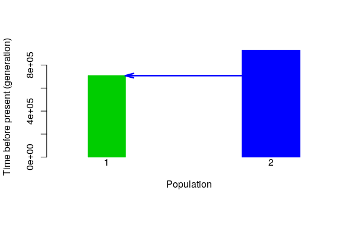
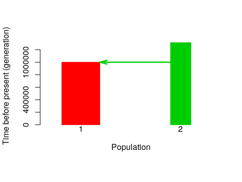
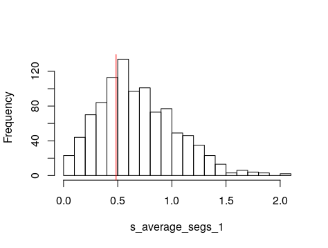
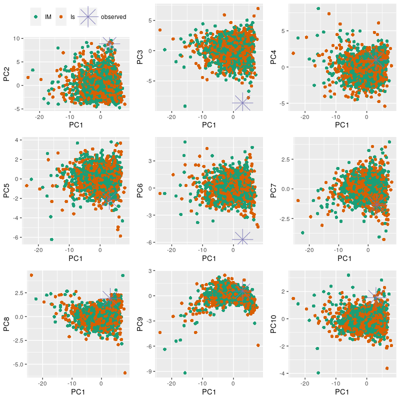

---
output:
  pdf_document: default
  word_document: default
  html_document: default
---
# Simulation and analysis with PipeMaster
  
  This is an R tutorial showing how to simulate data, test models, and estimate parameters using [*PipeMaster-0.2.2*](https://github.com/gehara/PipeMaster), *abc* and *caret* r-packages.
  The dataset in this tutorial is the same as in Gehara et al *in review*, and represents 2,177 UCE loci for the neotropical frog *Dermatonotus muelleri*. We will start working with a subset of the data (200 loci) in the first and second sections of this tutorial, and then use the entire dataset in the third part. For more information about *Dermatonotus muelleri* see [Gehara et al. *in review*](PipeMaster.pdf) and [Oliveira et al. 2018](https://www.researchgate.net/profile/Adrian_Garda/publication/327624820_Phylogeography_of_Muller%27s_termite_frog_suggests_the_vicariant_role_of_the_Central_Brazilian_Plateau/links/5c40f99f92851c22a37d572c/Phylogeography-of-Mullers-termite-frog-suggests-the-vicariant-role-of-the-Central-Brazilian-Plateau.pdf)
  
# Contents

## 1. [Installation](#installation)
    
## 2. [First Part](#first-part): building a model, calculating sumstats and simulating 

  2.1 [Main Menu](#main-menu)

  2.1.2 [Gene Menu](#gene-menu)

  2.1.2.1 [Mutation rate prior](#mutation-rate-prior)

  2.1.3 [Model Visualization](#model-visualization)

  2.1.4 [Ne Priors Menu](#ne-priors-menu)

  2.1.5 [Time Priors Menu](#time-priors-menu)

  2.1.6 [Conditions Menu](#condistions-menu)

  2.1.6.1 [Matrix of parameter conditions](#matrix-of-parameter-conditions)

  2.1.7 [Migration prior menu](#migration-prior-menu)

  2.2 [Generating a model from a template](#generating-a-model-from-a-template)

  2.3 [Model Object](#model-object)

  2.4 [Checking model parameters and manipulating prior values](#checking-model-parameters-and-manipulating-prior-values)
  
  2.5 [Saving and reloading a model](#saving-and-reloading-a-model)
  
  2.6 [Replicating the empirical data structure to the model](#replicating-the-empirical-data-structure-to-the-model)
  
  2.7 [Summary statistics calculation](#summary-statistics-calculation)
  
  2.8 [Simulating Data](#simulating-data)
  
## 3. [Second Part](#second-part): visualization and plotting functions
  
  3.1 [Plotting a Model](#plotting-a-model)
  
  3.2 [Visualize prior distributions](#visualize-prior-distributions)
  
  3.3 [Plotting simulations against empirical data](#plotting-simulations-against-empirical-data)
  
  3.4 [Plotting a PCA](#plotting-a-pca)

## 4. [Third Part](#third-part): data analysis, approximate Bayesian computation (ABC) & supervised machine-learning (SML)
  
  4.1 [Approximate Bayesian computation for model inference](#approximate-bayesian-computation-for-model-inference)
  
  4.2 [Approximate Bayesian computation for parameter inference](#approximate-bayesian-computation-for-parameter-inference)

  4.3 [Supervised machine-learning analysis for model classification](#supervised machine-learning-analysis-for-model-classification)
  
------------------------------------------------------------------------------------------------------
  
# **Installation** 
PipeMaster can be installed from github using *devtools* (to get the latest version with the most recent updates), or you can download and install the latest release from my [github](github.com/gehara/PipeMaster) repository.

**Installation with devtools** 
Go to the R console, install devtools and then PipeMaster:  
  
  ```
  install.packages("devtools")
  devtools::install_github("gehara/PipeMaster")
  ## install  POPdemog to be able to plot your models                
  install.packages("https://github.com/YingZhou001/POPdemog/raw/master/POPdemog_1.0.3.tar.gz",
                 repos=NULL)
  
  ```

**Installation without devtools** 
Install all dependencies, install *PipeMaster* latest release from my github. You can do all of this inside the R console using the code below. You may need to check for the latest version and change it in the appropriate line <PipeMaster-0.2.2.tar.gz>.

  ```

  install.packages(c("ape","abc","e1071","phyclust","PopGenome","msm","ggplot2","foreach"),
                 repos="http://cran.us.r-project.org")

  install.packages("http://github.com/gehara/PipeMaster/archive/PipeMaster-0.2.2.tar.gz",
                 repos=NULL)
  
  ## install  POPdemog to be able to plot your models                
  install.packages("https://github.com/YingZhou001/POPdemog/raw/master/POPdemog_1.0.3.tar.gz",
                 repos=NULL)

  ```
  
-------

# **First Part** 
## building a model, calculating sumstats and simulating data
We will download some real data to use as an example. We are going to walk through the basics of the *Model Builder (main.menu function)* and set up a couple of models. We will run some simulations and calculate summary statistics for the downloaded data. *PipeMaster cannot simulate missing data or gaps, so sites with "?", "N" or "-" are not allowed. Each locus can have different number of individuals per population as long as there are more than 4.*

Create a new directory to save the examples
  
  ```
    ## install PipeMaster (see above).
    
    ### load PipeMaster
    library(PipeMaster)
    
    # see the working directory you are in
    getwd()
   
    # create a new directory to save outputs
    dir.create(paste(getwd(),"/PM_example",sep=""))
   
    # set this new folder as your working directory
    setwd(paste(getwd(),"/PM_example",sep=""))
  ```
  
Set up a model by going into the Model Builder. You will be prompted to an interactive menu. Assign this function to an object (*Is* in the case bellow) so your model is saved at the end. We are going to set up a 2 population model.

  ```
    Is <- main.menu()
    > write bifurcating topology in newick format or 1 for single population:
  ```

## **Main Menu**

We start by writing a 2 pop newick topology: *(1,2)*. This will set up a 2 pop isolation model with constant population size and no migration. You can follow the description in the menu to add parameters and priors to the model. The numbers on the right indicate the parameters of the model. This model has 2 population size parameters and 1 divergence parameter, or 1 junction in the coalescent direction. We are going to stick with a 3 parameter model for now. To visulize the model we need to specify the data to be simulated first. We nee to go to **Gene Menu** for that.

```
  A > Number of populations to simulate      2
  B > Tree (go here to remove nodes)         (1,2)
      Number of nodes (junctions)            1
  C > Migration                              FALSE
  D > Pop size change through time           FALSE
  E > Setup Ne priors
      Population size parameters (total)     2
      current Ne parameters                  2
      ancestral Ne parameters                0
  F > Setup Migration priors
      current migration                      0
      ancestral migration parameters         0
  G > Setup time priors
      time of join parameters                1
      time of Ne change parameters           0
      time of Migration change parameters    0
  H > Conditions
  I > Gene setup
  P > Plot Model
  Q > Quit, my model is Ready!
  Model Builder>>>>
```

## **Gene Menu**

Type **I** in the **main menu** to go to the gene menu. To get into the **gene menu** you will need to answer two questions. *What type of data you want to simulate (sanger or genomic)?* and *how many loci?*. We will simulate 200 UCE loci according to the downloaded data. Thus we answer **genomic** or **g** and **200**.

```
  Model Builder >>>>I
  What type of data to simulate (sanger or genomic)?:genomic
  how many loci to simulate? You should include all invariable locus: 200
  M > Mutation rate prior distribution:   uniform
  P > priors                           Min - Max
                                    1e-11   1e-09

  1 > number of loci
                                200

  B > Back to main menu
  >>>>
```

## **Mutation rate prior**

**In the case of genomic data the mutation rate works as a hyperparameter**. The default uniform distribution above indicates the *min* and *max* values to sample an average and SD of all mutation rates. That is, the actual mutation rate for each of the 200 loci will be sampled from a normal distribution with average and SD sampled from this uniform prior. In each simulation iteration a new average and SD are sampled and from these parameters the 200 mutation rates are sampled. This normal distribution is truncated at zero, so it doesn't not really always have a bell shape. You can set other distributions to sample the mutation rate from. All distributions available in R are allowed, but this distribution is specified in the simulation function (*sim.msABC.sumstat*). We will see this further in the tutorial.


## **Model Visualization**
Now that we specified the type of data we will simulate we can visualize the model by typing **P** or **p**. It will ask if you are plotting a model with an exponential size change. Since our model has no size change we will choose FALSE.

```
  Model Builder >>>>P
  exponential size change (TRUE or FALSE)? F
  
```



## **Ne Priors Menu** 

Let's check the Ne priors by typing *E* in the *main menu*. In this menu you can see the parameter names and their distribution. PipeMaster has as default uniform distributions with min and max values of 100,000 and 500,000 individuals respectively. The name Ne0.pop1 indicates that the parameter is contemporary, hence Ne0. Ancestral parameters will have ascending numbers going to the past. For instance, *Ne1.pop1* is the ancestral Ne after *Ne0*, *Ne2* is the ancestral Ne after *Ne1* and so on. Let's change one of the priors. Type **C** and then follow the instructions of the menu.  

```
  N > Ne prior distribution:               uniform
  D > Different ancestral Ne?              FALSE
  C > current Ne priors                       min, max
                    1   Ne0.pop1        1e+05       5e+05
                    2   Ne0.pop2        1e+05       5e+05

  B > Back to main menu
  >>>>C
```
You need to specify the number of the parameter you want to change and then the two parameters of the distribution. Since we are using *uniform* distribution we need to set up the *min* and *max* values. We will change the values for the **Ne0.pop1** to min = 2e5, max = 1e6. Then type **B** to go back to the **main.menu**

```
>>>C
Which parameter do you want to set up? (write the reference number from the menu): 1
Ne prior (4Nm) Ne0.pop1 min: 2e5
Ne prior (4Nm) Ne0.pop1 max: 1e6
N > Ne prior distribution:               uniform
D > Different ancestral Ne?              FALSE
C > current Ne priors                     min, max
                 1   Ne0.pop1        2e5        1e6
                 2   Ne0.pop2        1e+05      5e+05
 
B > Back to main menu
>>>>B
```
## **Time Priors Menu**

Type **G** in the **main menu** to go to **time priors**. In the **time prior** menu you can see all parameters relative to time. In this model we have a single parameter, *join1_2*, which represents the junction (or divergence in real life direction) of population 1 and 2. The default of PipeMaster is a uniform distribution with *min* and *max* of *500,000* and *1,500,000* generations. **Time is measured in generations**. If your organism has a generation time different than 1 year, you will need to convert the time from years to generations in order to set up your prior. For example, if you want to setup a divergence between 100,000 and 1,000,000 years and your organism has a generation time of 4 years, you will need to divide the time by 4. Your min and max values will be 25,000 ans 250,000. Type **B** to go back to the main menu.

```
  P > Time prior distribution:     uniform
      Time priors                   Min - Max
    J >  time of junctions:
                      1    join1_2    5e+05   1500000


  B > Back to Ne menu
```

## **Conditions Menu**

Type **H** in the **main menu** to go to the **conditions menu**. Here you get a list of parameters and some options. You can use the options represented by the letters to set up a condition on your parameters. For example if you want Ne0.pop1 to be always larger than Ne0.pop2 and their priors overlap you can go to option **S** and setup a size condition. Let's try this.

```
  Model Builder >>>> H
  size parameter               --  Ne0.pop1
  size parameter               --  Ne0.pop2


  time parameter               --  join1_2

  S > place a size condition
  T > place a time condition

  1 > see size matrix
  3 > see time matrix
  B > back to main menu
  >>>>S
```

## **Matrix of parameter conditions**

This matrix indicates the parameter conditions where *NA* means there is no condition. Let's try to set up a condition. We want **Ne0.pop1** to be always larger than **Ne0.pop2**, so we need to write **Ne0.pop1 > Ne0.pop2** as explaned in the menu.

```
           Ne0.pop1 Ne0.pop2
  Ne0.pop1        0       NA
  Ne0.pop2       NA        0
  Write the name of 2 parameters with a logic sign inbetween ( >  or < or = ) separated by a space.
                Ex.: Ne0.pop1 < Ne0.pop2

  Ne0.pop1 > Ne0.pop2 

  size parameter               --  Ne0.pop1
  size parameter               --  Ne0.pop2


  time parameter               --  join1_2

  S > place a size condition
  T > place a time condition

  1 > see size matrix
  3 > see time matrix
  B > back to main menu
  >>>>
```

Now you can see the size matrix by typing **1** in the menu. You can see that the matrix indicates that Ne0.pop1 > Ne0.pop2.

```
  >>>>1
           Ne0.pop1 Ne0.pop2
  Ne0.pop1 "0"      ">"
  Ne0.pop2 "<"      "0"
  [1] "-----------------"
  size parameter               --  Ne0.pop1
  size parameter               --  Ne0.pop2


  time parameter               --  join1_2

  S > place a size condition
  T > place a time condition

  1 > see size matrix
  3 > see time matrix
  B > back to main menu
  >>>>
```

Now go back to the **main menu** and hit **Q** to get out of the **Model Builder**.


## **Generating a model from a template**

Our model was saved in the object **Is**. We can easily generate another model using a previous model as template. We are going to use our **Is** model to generate a similar model but with gene flow. Let's call this model **IM**, isolation with migration. We will go directly to the **main menu**. We will then type **C** to include migration parameters, than type **y** or **yes**.

```
  IM <- main.menu(Is)

  A > Number of populations to simulate      2
  B > Tree (go here to remove nodes)         (1,2)
      Number of nodes (junctions)            1
  C > Migration                              FALSE
  D > Pop size change through time           FALSE
  E > Setup Ne priors
      Population size parameters (total)     2
      current Ne parameters                  2
      ancestral Ne parameters                0
  F > Setup Migration priors
      current migration                      0
      ancestral migration parameters         0
  G > Setup time priors
      time of join parameters                1
      time of Ne change parameters           0
      time of Migration change parameters    0
  H > Conditions
  I > Gene setup
  P > Plot Model
  Q > Quit, my model is Ready!
  Model Builder >>>>C
----------------------------------------------
  Migration among populations (YES or NO)?: Y
  A > Number of populations to simulate      2
  B > Tree (go here to remove nodes)         (1,2)
      Number of nodes (junctions)            1
  C > Migration                              TRUE
  D > Pop size change through time           FALSE
  E > Setup Ne priors
      Population size parameters (total)     2
      current Ne parameters                  2
      ancestral Ne parameters                0
  F > Setup Migration priors
      current migration                      2
      ancestral migration parameters         0
  G > Setup time priors
      time of join parameters                1
      time of Ne change parameters           0
      time of Migration change parameters    0
  H > Conditions
  I > Gene setup
  P > Plot Model
  Q > Quit, my model is Ready!
  Model Builder >>>>
```

## **Migration prior menu**

In option we can go into the *migration menu*. Migration is measured in *4Nmij* where *mij* is the fraction of individuals in population *i* made up of migrants from population *j*.

```
  M > Migration prior distribution:        uniform
  D > Different ancestral migration?          FALSE
  P > priors                           Min - Max
                      1   mig0.1_2    0.1   1
                      2   mig0.2_1    0.1   1

  B > Back to main menu
  >>>>
```

Let's go back to the main menu and then quit. The model is saved in the object **IM**.
  
## **Model Object** 

By typing the model name in the R console we can see its contents. You don't have to know how to read the model object, but it might help you understand how the package works. The *loci* index shows your loci with mutation rates. the *I* index shows the population structure, the third column indicates the number of pops and the following columns indicate the number of individuals for each population. The *flags* index shows the parameters of your model with respective priors. The *conds* index shows the condition matrices and the *tree* parameter shows the topology of the model.

```
  > Is

  $loci
       [,1]      [,2] [,3]  [,4]    [,5]    [,6]
  [1,] "genomic" "bp" "200" "1e-11" "1e-09" "runif"

  $I
       [,1]      [,2] [,3] [,4] [,5]
  [1,] "genomic" "-I" "2"  NA   NA

  $flags
  $flags$n
       [,1]       [,2] [,3] [,4]    [,5]    [,6]
  [1,] "Ne0.pop1" "-n" "1"  "1e+05" "5e+05" "runif"
  [2,] "Ne0.pop2" "-n" "2"  "1e+05" "5e+05" "runif"

  $flags$ej
       [,1]      [,2]  [,3]  [,4]    [,5]      [,6]
  [1,] "join1_2" "-ej" "1 2" "5e+05" "1500000" "runif"


  $conds
  $conds$size.matrix
           Ne0.pop1 Ne0.pop2
  Ne0.pop1 "0"      ">"
  Ne0.pop2 "<"      "0"

  $conds$time.matrix
          join1_2
  join1_2       0


  $tree
  [1] "(1,2)"

  attr(,"class")
  [1] "Model"
```

## **Checking model parameters and manipulating prior values** 

There is an easier way to check the model parameters and priors. You can also update your prior without using the *main.menu* function. To see your priors use *get.prior.table*. This function generates a table with the model parameters and priors. You can then alter this table and use it to update the prior values of your model using *update.priors*. Note that for the update.prior to work, the parameters in the table and model object have to be the same.


```
  > Is.tab <- get.prior.table(model=Is)
  > Is.tab

    Parameter prior.1 prior.2 distribution
  1  Ne0.pop1   1e+05   5e+05        runif
  2  Ne0.pop2   1e+05   5e+05        runif
  3   join1_2   5e+05 1500000        runif


  > Is.tab[,2:3] <- 1000
  > Is.tab
  
       Parameter prior.1 prior.2 distribution
    1   Ne0.pop1    1000    1000        runif
    2   Ne0.pop2    1000    1000        runif
    3      join1    1000    1000        runif
  
  
  > Is2 <- PipeMaster:::update.priors(tab = Is.tab, model = Is)
  > get.prior.table(model=Is2)
  
       Parameter prior.1 prior.2 distribution
    1   Ne0.pop1    1000    1000        runif
    2   Ne0.pop2    1000    1000        runif
    3      join1    1000    1000        runif
```

## **Saving and reloading a model** 

You can save the model as a text file using *dput*. To read the model back to R use *dget*.
  
```
    dput(Is, "Is.txt")
    Is <- dget("Is.txt")
```

## **Replicating the empirical data structure to the model**

To have the model ready for the simulation we need to replicate the data structure to the model. We need to setup the exact number of individuals per population and the length of each locus. To do this we use the **get.data.structure** function. This function needs: (i) an assignment file, a two column data frame with the name of the individuals and their respective population; and (ii) a model object where the structure will be replicated; (iii) the path to the empirical data set that should be replicated.
  
Load and write some empirical data (dna sequences). 

  ```
  # load the data
  data("seqs", package = "PipeMaster")

  # create a directory to save the sequences
  dir.create("fastas")
  
  # vavigate to the directory
  setwd("./fastas")
  
  # write the fasta alignments
  for(i in 1:length(seqs)){
    write.dna(seqs[[i]], file = paste("seq",i,".fas",sep="_"), format = "fasta")
  }
  
  # go back one dir
  setwd("../")
    
  # check how any files are inside the fastas folder
  length(list.files("./fastas"))
  ```
  
Instead of simulating the models we created we are going to simulate three models available as example in the package. The example data available in *PipeMaster* is based on [Gehara et al. *in review*](PipeMaster.pdf) which is the paper that describes the package. [**Here**](https://docs.google.com/spreadsheets/d/1FZonOF27VgGKiAgWQS56zZ4G5bbtz5t_-302LJQFlQA/edit?usp=sharing) you can access a spread sheet with all 10 models with respective parameters and priors. Remeber, you can use them as templates for your own analysis. You will just need to update the priors as above, and replicate your data structure to the model using the *get.data.structue* as explaned above. Among the available models there is also an *Is* and an *IM* model - just like the ones we built but with different prior values - so we will simulate these. The third model is the *IsBot2*, which is the same as *Is* but with a bottleneck for one of the populations. We will also load the example assignment file for this empirical data.
  
```
    # load the example assignment file.
    data(popassign, package="PipeMaster")
    
    # load some available models
    data(models, package="PipeMaster")

    # replicate the data structure
    Is <- get.data.structure(model = Is, 
    path.to.fasta = "./fastas", pop.assign = popassign, sanger = F)

    IM <- get.data.structure(model = IM,
    path.to.fasta = "./fastas", pop.assign = popassign, sanger = F)

    IsBot2 <- get.data.structure(model = IsBot2, 
    path.to.fasta = "./fastas", pop.assign = popassign, sanger = F) 
  
    ## !!! save the models!! ##
    dput(Is, "Is.txt")
    dput(IM, "IM.txt")
    dput(IsBot2, "IsBot2.txt")

```
  
## **Summary statistics calculation**

To calculate the summary statistics for the empirical data we will use the **obs.sumstat.ngs** function. This function also needs an assignment file and a model object. By default PipeMaster calculates all the available summary statistics, you select them *a posteriori*.

```
  obs <- obs.sumstat.ngs(model = Is, path.to.fasta = "./fastas", pop.assign = popassign)
```
To see the observed summary stats just type **obs**.
To see the name of the summary stats **colnames(obs)**
  
```
 > colnames(obs)
  
   [1] "s_average_segs_1"               "s_variance_segs_1"
   [3] "s_average_segs_2"               "s_variance_segs_2"
   [5] "s_average_segs"                 "s_variance_segs"
   [7] "s_average_pi_1"                 "s_variance_pi_1"
   [9] "s_average_pi_2"                 "s_variance_pi_2"
  [11] "s_average_pi"                   "s_variance_pi"
  [13] "s_average_w_1"                  "s_variance_w_1"
  [15] "s_average_w_2"                  "s_variance_w_2"
  [17] "s_average_w"                    "s_variance_w"
  [19] "s_average_tajd_1"               "s_variance_tajd_1"
  [21] "s_average_tajd_2"               "s_variance_tajd_2"
  [23] "s_average_tajd"                 "s_variance_tajd"
  [25] "s_average_ZnS_1"                "s_variance_ZnS_1"
  [27] "s_average_ZnS_2"                "s_variance_ZnS_2"
  [29] "s_average_ZnS"                  "s_variance_ZnS"
  [31] "s_average_Fst"                  "s_variance_Fst"
  [33] "s_average_shared_1_2"           "s_variance_shared_1_2"
  [35] "s_average_private_1_2"          "s_variance_private_1_2"
  [37] "s_average_fixed_dif_1_2"        "s_variance_fixed_dif_1_2"
  [39] "s_average_pairwise_fst_1_2"     "s_variance_pairwise_fst_1_2"
  [41] "s_average_fwh_1"                "s_variance_fwh_1"
  [43] "s_average_fwh_2"                "s_variance_fwh_2"
  [45] "s_average_FayWuH"               "s_variance_FayWuH"
  [47] "s_average_dvk_1"                "s_variance_dvk_1"
  [49] "s_average_dvh_1"                "s_variance_dvh_1"
  [51] "s_average_dvk_2"                "s_variance_dvk_2"
  [53] "s_average_dvh_2"                "s_variance_dvh_2"
  [55] "s_average_dvk"                  "s_variance_dvk"
  [57] "s_average_dvh"                  "s_variance_dvh"
  [59] "s_average_thomson_est_1"        "s_variance_thomson_est_1"
  [61] "s_average_thomson_est_2"        "s_variance_thomson_est_2"
  [63] "s_average_thomson_est"          "s_variance_thomson_est"
  [65] "s_average_thomson_var_1"        "s_variance_thomson_var_1"
  [67] "s_average_thomson_var_2"        "s_variance_thomson_var_2"
  [69] "s_average_thomson_var"          "s_variance_thomson_var"
  [71] "s_average_pi_1_s_average_w_1"   "s_variance_pi_1_s_variance_w_1"
  [73] "s_average_pi_2_s_average_w_2"   "s_variance_pi_2_s_variance_w_2"
  [75] "s_average_pi_s_average_w"       "s_variance_pi_s_variance_w"
```
  
There are **76** summary statistics for this data, these are averages and variances across loci, for each population and overall. We are going to use **grep** to select the stats we want to exclude. Descriptions of summary statistics are found in the [msABC manual](https://www.dropbox.com/s/m1mkmp0xtiv2a3x/manual.pdf?dl=0)


```
  cols <- c(grep("thomson", colnames(obs)),
              grep("pairwise_fst", colnames(obs)),
              grep("Fay", colnames(obs)),
              grep("fwh", colnames(obs)),
              grep("_dv", colnames(obs)),
              grep("_s_", colnames(obs)),
              grep("_ZnS", colnames(obs)))
            
  obs <- t(data.frame(obs[,-cols]))
```
Check the sumstats names again

```
  > colnames(obs)

   [1] "s_average_segs_1"         "s_variance_segs_1"
   [3] "s_average_segs_2"         "s_variance_segs_2"
   [5] "s_average_segs"           "s_variance_segs"
   [7] "s_average_pi_1"           "s_variance_pi_1"
   [9] "s_average_pi_2"           "s_variance_pi_2"
  [11] "s_average_pi"             "s_variance_pi"
  [13] "s_average_w_1"            "s_variance_w_1"
  [15] "s_average_w_2"            "s_variance_w_2"
  [17] "s_average_w"              "s_variance_w"
  [19] "s_average_tajd_1"         "s_variance_tajd_1"
  [21] "s_average_tajd_2"         "s_variance_tajd_2"
  [23] "s_average_tajd"           "s_variance_tajd"
  [25] "s_average_ZnS"            "s_variance_ZnS"
  [27] "s_average_Fst"            "s_variance_Fst"
  [29] "s_average_shared_1_2"     "s_variance_shared_1_2"
  [31] "s_average_private_1_2"    "s_variance_private_1_2"
  [33] "s_average_fixed_dif_1_2"  "s_variance_fixed_dif_1_2"
```

Save the observed as a table using **write.table**.

```
  write.table(obs,"observed.txt", quote=F,col.names=T, row.names=F)
```

## **Simulating Data**

Now that we have two models, **Is** and **IM** we are going to simulate summary statistics. We will use the *sim.msABC.sumstat* to simulate genomic data. This function only works in linux and Mac. PipeMaster controls *msABC* to simulate the data. It simulates data in batches or blocks to avoid memory overload in R and at the same time optimize the time spent in writing the simulations to file. To control the total number of simulations you have to control the size of the simulation block, the number of blocks to simulate, and the number of cores used. The total number of simulations = nsim.blocks *x* block.size *x* ncores. You can play with these values to optimize the speed of the simulation process. A small block size will take less RAM but will require a more frequent management of the slave nodes by the master node. This can be time consuming. A large block size may overload R, R can't handle a lot of memory very well. It can also take up too much RAM, specially if you are running several cores at the same time. PipeMaster will output a time estimate at the console. This might help you optimize the parameters. From my experience, a block.size of 1000 will be good for most cases. If you don't want to mess with this, just leave at 1000, it should work fine.


```
  sim.msABC.sumstat(Is, nsim.blocks = 1, use.alpha = F, 
  output.name = "Is", append.sims = F, block.size =   500, ncores = 2)

  sim.msABC.sumstat(IM, nsim.blocks = 1, use.alpha = F, 
  output.name = "IM", append.sims = F, block.size =   500, ncores = 2)
                    
  sim.msABC.sumstat(IsBot2, nsim.blocks = 1, use.alpha = F, 
  output.name = "IsBot2", append.sims = F, block.size =   500, ncores = 2)

```
-------------------------------------------------------------------------------------------------------

# **Second part**
# visualizations and plotting functions

In this part of the tutorial we will go through some of the visualization functions of PipeMaster.

## **Plotting a Model**

There is now a new function in PipeMaster to plot your model. This function is a wrapper of the PlotMS function from the POPdemog r-package. I have not tested it extensively yet, if you find bugs please send me an email (marcelo.gehara@gmail.com). 
```
PlotModel(model=Is, use.alpha = F, average.of.priors=F)
PlotModel(model=IM, use.alpha = F, average.of.priors=F)
PlotModel(model=IsBot2, use.alpha = c(T,1), average.of.priors=F)
```




## **Visualize prior distributions**

We can use the *plot.prior* function to visualize the prior distributions. 
  
```
PipeMaster:::plot.priors(Is, nsamples = 1000)
```


## **Plotting simulations against empirical data**

Let's visualize the simulations. Read the simulations back into R. If your simulation file is very big (you have many simulations, like 5E5 or more) you should use the bigmemory r-package to handle the data. We will also match the simulations sumstats to the observed so that we keep the same set of sumstats in the simulated. 

```
Is.sim <- read.table("SIMS_Is.txt", header=T)
IM.sim <- read.table("SIMS_IM.txt", header=T)
IsBot2.sim <- read.table("SIMS_IsBot2.txt", header=T)

Is.sim <- Is.sim[,colnames(Is.sim) %in% colnames(obs)]
IM.sim <- IM.sim[,colnames(IM.sim) %in% colnames(obs)]
IsBot2.sim <- IsBot2.sim[,colnames(IsBot2.sim) %in% colnames(obs)]
```

Now we can plot the observed againt the simulated. This helps you evaluate your model and have a visual idea of how the simulations fit the empirical data. 

```
PipeMaster:::plot.sim.obs(Is.sim, obs)
PipeMaster:::plot.sim.obs(IsBot2.sim, obs)
```


## **Plotting a PCA**

We can also plot a Principal Component Analysis of the simulations against the empirical data. This also helps evaluating the fit of your models. First we will combine the models in a single data frame and we will generate an index. 

```
models <- rbind(Is.sim, IM.sim, IsBot2.sim)
index <- c(rep("Is", nrow(Is.sim)), rep("IM", nrow(IM.sim)), rep("IsBot2", nrow(IsBot2.sim)))
plotPCs(model = models, index = index, observed = obs, subsample = 1)
```


-------------------------------------------------------------------------------------

# **Third part**
# approximate Bayesian computation (ABC) & supervised machine-learning (SML)**

In the last part of the tutorial we are going to perform the data analysis using *PipeMaster*, *abc* and *caret* r-packages.

---

* **This part of the tutorial is limited to a single case**, you should latter check the following materials if you plan to perform any of these analyses:

* (i) The [**vignette**](https://cran.r-project.org/web/packages/abc/vignettes/abcvignette.pdf) of the *abc* is very informative and covers the entire package.

* (ii) *caret* is a very extensive package for machine-learning, there are hundreds of algorithms avalable with extensive [**online documentation**](http://topepo.github.io/caret/index.html).

* (iii) [Here](https://www.youtube.com/watch?v=aircAruvnKk) is a series of YouTube videos explaning Neural Networks in much more detail, I took some of the material from these videos. 

---

## **Approximate Bayesian computation for model inference**

*abc* is the package used for the *Approximate Bayesian Computation* and it is already a dependency of *PipeMaster* so we don't nee to load it. We already have the models combined in a single table, the index and the observed which is what we need to run ans ABC analysis. We will run the function *postpr* with *rejection* algorithm to calculate the probability of each model.

```
  prob <- postpr(target = obs, sumstat = models, index = index, method = "rejection",   tol=0.1)

  summary(prob)
```

**Cross-validation** 

It is important to perform a cross-validation to evaluate if the models are identifiable and how confident can we be regarding our estimates. We use the function *cv4postpr* to run the cross-validation.

```
  CV <- cv4postpr(sumstat = models, index = index, method = "rejection", tol=0.1, nval = 20)

  summary(CV)

  plot(CV)
  
  # overall accuracy
  acc <- summary(CV)
  sum(diag(acc$conf.matrix$tol0.1))/60
  
```

## **Approximate Bayesian computation for parameter inference**. 

The *abc* performs a rejection step for parameter estoimates as well. For this we will use just the best model.
  
```
# read selected model
IsBot2.sim <- read.table("SIMS_IsBot2.txt", header=T)
  
# separate summary statistics from parameters
sims <- IsBot2.sim[,colnames(IsBot2.sim) %in% colnames(observed)]
param <- IsBot2.sim[,1:11]
  
# estimate posterior distribution of parameters
  
posterior <- abc(target = observed,
            param = param,
            sumstat = sims,
            method = "rejection",
            tol=0.1) 
            
            summary(posterior)
            
# write results to file
write.table(summary(posterior), "parameters_est.txt")
```  

Plot posterior distribution

```
# plot posterior probabilities against prior
  for(i in 1:ncol(param)){
    plot(density(posterior$unadj.values[,i]), col=2, main = colnames(param)[i])
    lines(density(param[,i]))
  }
```

**Cross-validation** 

It is important to perform a cross-validation to evaluate if the models are identifiable and how confident can we be regarding our estimates. The function *cv4abc* performs a leave-one-out experiment to evaluate the performance of the method. To correctly do this we have to use the same tolerace value and *method* with the same parameters as used above. 

```
# cross-validation for parameter estimates
cv <- cv4abc(param = param,
              sumstat = sims,
              nval = 20,
              method = "rejection",
              tol = 0.1)
  
plot(cv)
  
```
Check the error of the estimate

```
summary(cv)
```
  

## **Supervised machine-learning analysis for model classification**. 

We are going to train a neural network algorithm and then use it to classify our empirical data. In the paper that describes the package, [Gehara et al. *in review*](PipeMaster.pdf), I ran a simulation experiment to compare ABC rejection with SML with neural network and I found that the SML is much more efficient and accurate.

We need to install and load *caret* package. To run *caret* in parallel we need to load a r-package that manages nodes to run loops in parallel using MPI. There are several r-packages for this, we are going to use *doMC*.

``` 
install.packages("caret")
library(caret) # caret: used to perform the superevised machine-learning (SML)

install.packages("doMC")  
library(doMC) # doMC: necessary to run the SML in parallel
``` 

To train the algorithm we need to split the data into training and testing, usually 75% is used for training and 25% for testing. We can do that with *createDataPartition*. We also need to specify our predictors and our outcome. In our case, the predictors are the summary statistics and the outcome is the model label or index. 

It can be very time consuming to set up the parameters of the neural network, and there is no objective way to decide which parameters values to use. To help deciding the parameter values, *caret* runs the training multiple times with different parameters values to see which combination gets the highest accuracy in model selection. And it does this using different resampling methods. You can set up the number of replicates and the resampling method used in the *trainControl* function.
 
```
  # set up number of cores for SML
  registerDoMC(1)
  
  ## combine simulations and index
  models <- cbind(models,data)
  
  ## setup the outcome (name of the models, cathegories)
  outcomeName <- 'data'
  
  ## set up predictors (summary statistics)
  predictorsNames <- names(models)[names(models) != outcomeName]
  
  ## split the data into trainning and testing sets; 75% for trainning, 25% testing
  splitIndex <- createDataPartition(models[,outcomeName], p = 0.75, list = FALSE, times = 1)
  train <- models[ splitIndex,]
  test  <- models[-splitIndex,]
  
  ## bootstraps and other controls
  objControl <- trainControl(method='boot', number=1, returnResamp='final',
                             classProbs = TRUE)
  ## train the algoritm
  nnetModel_select <- train(train[,predictorsNames], train[,outcomeName],
                            method="nnet",maxit=5000,
                            trControl=objControl,
                            metric = "Accuracy",
                            preProc = c("center", "scale"))
                            
  ## predict outcome for testing data, classification
  predictions <- predict(object=nnetModel_select, test[,predictorsNames], type='raw')
  
  ## calculate accuracy in model classification
  accu <- postResample(pred=predictions, obs=as.factor(test[,outcomeName]))
  
  ## predict probabilities of the models for the observe data
  pred <- predict(object=nnetModel_select, observed, type='prob')
  
  # visualize results
  t(c(pred,accu))
  
  # write results to file
  write.table(c(pred,accu),"results.selection.txt")
```

Visualize and write results to file

```
# visualize results
t(c(pred,accu))
  
# write results to file
write.table(c(pred,accu),"results.selection.txt")
```

**Codemographics**

Check the [hABC manual](https://github.com/gehara/PipeMaster/blob/master/hABC_manual.md) if you want to try a codemographic analysis with single-locus data

# FIM!


  
  
