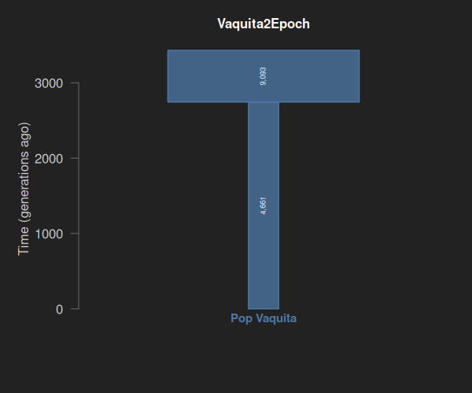
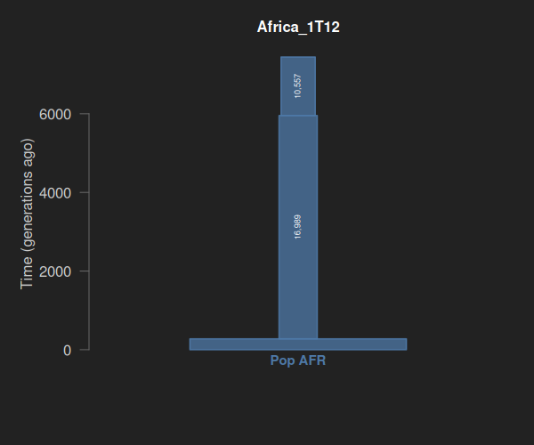
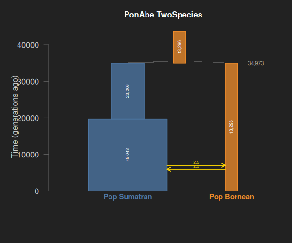
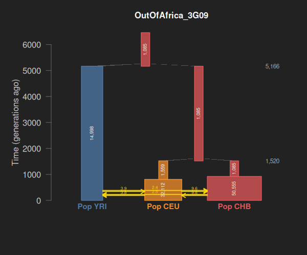

This tutorial demonstrates PipeMaster's two main inference pipelines — **Site Frequency Spectrum (SFS)** and **summary statistics** — using four well-characterized demographic models from [stdpopsim](https://popsim-consortium.github.io/stdpopsim-docs/stable/). Because these models have known true parameters, we can verify that PipeMaster's simulations and ABC estimation recover the correct values.

## Contents

1. [Installation](#installation)
2. [Demographic Models](#demographic-models)
3. [Building Models in PipeMaster](#building-models-in-pipemaster)
4. [Pseudo-Observed Data](#pseudo-observed-data)
5. [SFS-Based Inference](#sfs-based-inference)
6. [Summary Statistics-Based Inference](#summary-statistics-based-inference)
7. [Visualization](#visualization)
8. [References](#references)

---

## 1. Installation

Install PipeMaster from GitHub:

```r
install.packages("devtools")
devtools::install_github("gehara/PipeMaster")
```

Load the package:

```r
library(PipeMaster)
```

PipeMaster depends on `ape`, `abc`, `e1071`, and `msm`. These are installed automatically. For the Shiny GUI, you also need `shinydashboard`, `shinyjs`, and `DT`.

### Simulation engine

PipeMaster includes modified versions of **ms** (Hudson 2002) and **msABC** (Pavlidis et al. 2010) compiled as native C code that runs directly within R — no external binaries or system calls are needed. The ms engine generates coalescent genealogies and sequence data, while the msABC extension computes summary statistics (nucleotide diversity, Tajima's D, FST, etc.) on the fly during simulation. The SFS is also computed natively in C from the coalescent output. This integrated approach makes PipeMaster portable across platforms and avoids the overhead of writing and parsing intermediate files.

### Parameter scaling

The coalescent simulator ms works with scaled parameters. PipeMaster handles this conversion internally — **you specify parameters in natural units** (actual Ne, generations, per-bp mutation rate) and PipeMaster rescales them before passing to ms:

| Natural unit | Coalescent scale | Formula |
|---|---|---|
| Effective population size (Ne) | Relative size | Ne / Ne0 |
| Time (generations) | Coalescent time | t / (4 * Ne0) |
| Mutation rate (per bp per gen) | Theta per locus | 4 * Ne0 * mu * L |
| Migration rate (fraction per gen) | Scaled migration | 4 * Ne0 * m |

Where **Ne0** is a reference effective population size used as the scaling constant, **mu** is the per-site per-generation mutation rate, **L** is the locus length in base pairs, and **m** is the per-generation migration fraction.

For single-population models, Ne0 is set to the sampled value of the current Ne. For multi-population models, Ne0 is fixed at 100,000 as an arbitrary reference — relative sizes and times are adjusted accordingly. Priors in PipeMaster are always specified in natural units (actual Ne, generations), so you never need to compute the scaling yourself.

### Workflow

A typical PipeMaster analysis follows these steps:

```
1. Build model          Define tree topology, Ne, migration, divergence times
       |                → main.menu.gui() or programmatic construction
       v
2. Set priors           Specify prior distributions for each parameter
       |                → get.prior.table(), update.priors()
       v
3. Observed data        Compute SFS or summary statistics from empirical data
       |                → obs.sfs() or obs.sumstat.ngs()
       v
4. Simulate             Generate reference table of simulations under the model
       |                → sim.sfs() or sim.sumstat()
       v
5. Inference            Compare observed to simulated, estimate parameters
       |                → abc() from the abc package
       v
6. Evaluate             Check posterior distributions, model fit
                        → posterior plots, cross-validation
```

---

## 2. Demographic Models

We use four stdpopsim models that cover the full range of demographic scenarios:

### 2.1 Vaquita2Epoch (Robinson et al. 2022)

A single-population bottleneck model for the vaquita porpoise (*Phocoena sinus*).

| Parameter | Value | Description |
|-----------|-------|-------------|
| Ne_present | 2,807 | Current effective population size |
| Ne_ancient | 4,485 | Ancestral effective population size |
| t_bottleneck | 2,162 gen | Time of size change |
| mu | 5.83e-9 | Mutation rate per bp per generation |

**Tree:** `(1);`



### 2.2 Africa_1T12 (Tennessen et al. 2012)

A single African population with three size epochs (ancient, middle, recent expansion).

| Parameter | Value | Description |
|-----------|-------|-------------|
| Ne_present | 432,125 | Current Ne (after recent growth) |
| Ne_middle | 14,474 | Ne during middle epoch |
| Ne_ancient | 7,310 | Ancestral Ne |
| t_middle | 205 gen | Start of recent expansion |
| t_ancient | 5,920 gen | Start of middle epoch |
| mu | 2.36e-8 | Mutation rate per bp per generation |

**Tree:** `(1);`



### 2.3 PonAbe TwoSpecies (Locke et al. 2011)

Two orangutan species (Sumatran and Bornean) with isolation-with-migration and exponential size change.

| Parameter | Value | Description |
|-----------|-------|-------------|
| Ne_Sumatran | 37,661 | Present Sumatran Ne (growth) |
| Ne_Bornean | 8,805 | Present Bornean Ne (decline) |
| Ne_ancestral | 17,934 | Ancestral Ne |
| t_split | 20,157 gen | Divergence time |
| m_S->B | 1.099e-5 | Migration rate Sumatran to Bornean |
| m_B->S | 6.646e-6 | Migration rate Bornean to Sumatran |
| mu | 2e-8 | Mutation rate per bp per generation |

**Tree:** `(1,2);`



### 2.4 OutOfAfrica_3G09 (Gutenkunst et al. 2009)

The classic three-population Out-of-Africa model (YRI, CEU, CHB) with migration and exponential growth in non-African populations.

| Parameter | Value | Description |
|-----------|-------|-------------|
| Ne_YRI | 12,300 | African population |
| Ne_CEU | 29,725 | European (present, after growth) |
| Ne_CHB | 54,090 | East Asian (present, after growth) |
| Ne_CEU_bot | 1,000 | European bottleneck size |
| Ne_CHB_bot | 510 | East Asian bottleneck size |
| Ne_ancestral | 7,300 | Deep ancestral Ne |
| t_EU_AS | 848 gen | CEU-CHB split |
| t_OoA | 5,600 gen | Out-of-Africa split |
| t_ancestral | 8,800 gen | Ancestral Ne change |
| mu | 2.35e-8 | Mutation rate per bp per generation |

**Tree:** `((1,2),3);`



---

## 3. Building Models in PipeMaster

### 3.1 Using the Shiny GUI

The recommended way to build models interactively:

```r
my.model <- main.menu.gui()
```

This launches a web-based GUI where you can:
- Set the population tree topology
- Configure Ne, migration, and time priors
- Set parameter conditions (e.g., Ne_pop1 > Ne_pop2)
- Configure loci and sample sizes
- Preview the model plot


### 3.2 Building models programmatically

For reproducible analyses, build models directly in R. Here is the Vaquita2Epoch model:

```r
n_loci <- 10000
n_hap  <- 40  # 20 diploid = 40 haploid samples

# Loci matrix: 10000 loci x 100bp
loci <- matrix(NA, nrow=n_loci, ncol=6)
for (i in 1:n_loci) {
  loci[i,] <- c("rate", "100", "1", "1e-10", "1e-08", "runif")
}

# Sample configuration
I <- matrix(NA, nrow=n_loci, ncol=4)
for (i in 1:n_loci) {
  I[i,] <- c(paste0("locus",i), "-I", "1", "40")
}

# Build model
Vaquita2Epoch <- list(
  loci = loci,
  I    = I,
  flags = list(
    n = matrix(c("Ne0.pop1", "-n", "1", "500", "10000", "runif"),
               nrow=1, ncol=6, byrow=TRUE),
    en = list(
      size = matrix(c("Ne1.pop1", "-en", "1", "1000", "15000", "runif"),
                    nrow=1, ncol=6, byrow=TRUE),
      time = matrix(c("t.Ne1.pop1", "-en", "1", "500", "5000", "runif"),
                    nrow=1, ncol=6, byrow=TRUE)
    ),
    ej = NULL
  ),
  conds = list(
    size.matrix = {
      sm <- matrix(NA, nrow=2, ncol=2)
      diag(sm) <- "0"
      rownames(sm) <- colnames(sm) <- c("Ne0.pop1","Ne1.pop1")
      # Bottleneck: present Ne < ancestral Ne
      sm["Ne0.pop1","Ne1.pop1"] <- "<"
      sm["Ne1.pop1","Ne0.pop1"] <- ">"
      sm
    },
    mig.matrix  = matrix(NA, nrow=0, ncol=0),
    time.matrix = {
      tm <- matrix("0", nrow=1, ncol=1)
      rownames(tm) <- colnames(tm) <- "t.Ne1.pop1"
      tm
    }
  ),
  tree = "(1);"
)
class(Vaquita2Epoch) <- "Model"
```

### 3.3 Checking and updating priors

Use `get.prior.table()` to inspect priors and `update.priors()` to modify them:

```r
tab <- get.prior.table(Vaquita2Epoch)
tab
#      Parameter prior.1 prior.2 distribution
# 1   Ne0.pop1     500   10000        runif
# 2   Ne1.pop1    1000   15000        runif
# 3 t.Ne1.pop1     500    5000        runif

# Narrow the Ne0 prior
tab[1, 2:3] <- c(1000, 5000)
Vaquita2Epoch <- update.priors(tab, Vaquita2Epoch)
```

### 3.4 Loading pre-built test models

All models in this tutorial are included in the test data:

```r
load("data_to_test/test_models.RData")
# Available: Africa_1T12, OutOfAfrica_2T12, OutOfAfrica_3G09,
#            Vaquita2Epoch, PonAbe_TwoSpecies
```

---

## 4. Pseudo-Observed Data

### 4.1 Pre-computed data

The pseudo-observed data for this tutorial was generated with [stdpopsim](https://popsim-consortium.github.io/stdpopsim-docs/stable/) (Adrion et al. 2020) — 10,000 independent loci of 100bp each per model. The pre-computed observed SFS and summary statistics are included in `data_to_test/test_models.RData`, which is loaded with:

```r
load("data_to_test/test_models.RData")
```

This provides the model objects and the following observed data:

| Object | Model | Type |
|--------|-------|------|
| `observed_sfs_Vaquita2Epoch` | Vaquita2Epoch | SFS |
| `observed_sfs_Africa_1T12` | Africa_1T12 | SFS |
| `observed_sfs_PonAbe` | PonAbe TwoSpecies | Joint SFS (2D) |
| `observed_sfs_OutOfAfrica_3G09` | OutOfAfrica_3G09 | Joint SFS (3D) |
| `observed_sumstats_Vaquita2Epoch` | Vaquita2Epoch | Summary statistics |
| `observed_sumstats_OutOfAfrica_3G09` | OutOfAfrica_3G09 | Summary statistics |

### 4.2 Computing observed SFS from your own data

For your own empirical data, use `obs.sfs()` to compute the observed SFS from PHYLIP or FASTA alignments:

```r
# From PHYLIP file (faster for many loci)
pop_assign <- read.table("my_pop_assign.txt", header = FALSE)
obs_sfs <- obs.sfs(model = my_model,
                   path.to.phylip = "my_data.phy",
                   pop.assign = pop_assign,
                   one.snp = TRUE)

# From FASTA directory (one file per locus)
obs_sfs <- obs.sfs(model = my_model,
                   path.to.fasta = "my_fasta_dir",
                   pop.assign = pop_assign,
                   one.snp = TRUE)
```

The `one.snp = TRUE` option samples one SNP per locus to reduce linkage-induced variance.

### 4.3 Computing observed summary statistics from your own data

Use `obs.sumstat.ngs()` for summary statistics from FASTA or PHYLIP data:

```r
pop_assign <- read.table("my_pop_assign.txt", header = FALSE)
obs_stats <- obs.sumstat.ngs(model = my_model,
                             path.to.phylip = "my_data.phy",
                             pop.assign = pop_assign)
```

---

## 5. SFS-Based Inference

The SFS workflow uses `sim.sfs()` to simulate site frequency spectra and the `abc` package for parameter estimation.

**Note:** PipeMaster's SFS includes the monomorphic class (bin 0), which counts loci with no segregating sites. This is important because the proportion of monomorphic loci carries information about effective population size and divergence times. Most SFS-based methods drop the monomorphic class, but retaining it improves parameter estimation, especially for recent bottlenecks and small populations.

### 5.1 Single-pop SFS: Vaquita2Epoch

```r
library(PipeMaster)
library(abc)
load("data_to_test/test_models.RData")

# Step 1: Simulate SFS reference table (100,000 simulations)
sim.sfs(model = Vaquita2Epoch,
        nsim.blocks = 10,
        block.size = 1000,
        use.alpha = FALSE,
        one.snp = TRUE,
        output.name = "sfs_vaq",
        ncores = 10)

# Step 2: Load simulations and observed SFS
sim_data <- read.table("SIM_SFS_sfs_vaq.txt", header = TRUE, sep = "\t")

# Separate parameters from SFS bins
sfs_cols   <- grep("^sfs_", colnames(sim_data), value = TRUE)
param_cols <- c("Ne0.pop1", "Ne1.pop1", "t.Ne1.pop1")
sim_sfs    <- as.matrix(sim_data[, sfs_cols])
sim_params <- as.matrix(sim_data[, param_cols])

# Observed SFS (from stdpopsim or obs.sfs)
obs_sfs <- as.numeric(observed_sfs_Vaquita2Epoch[1, sfs_cols])

# Step 3: ABC parameter estimation
posterior <- abc(target  = obs_sfs,
                param   = sim_params,
                sumstat = sim_sfs,
                tol     = 0.005,
                method  = "neuralnet",
                numnet  = 10,
                sizenet = 10)

summary(posterior)

# Compare with true values
# Ne0.pop1 = 2807, Ne1.pop1 = 4485, t.Ne1.pop1 = 2162
```

### 5.2 Single-pop SFS with growth: Africa_1T12

The Africa_1T12 model has exponential growth. Use `use.alpha = TRUE` to enable exponential size change in the most recent epoch:

```r
sim.sfs(model = Africa_1T12,
        nsim.blocks = 10,
        block.size = 1000,
        use.alpha = TRUE,
        one.snp = TRUE,
        output.name = "sfs_afr",
        ncores = 10)
```

For models without an outgroup, use folded SFS:

```r
# Simulated folded SFS
sim.sfs(model = Africa_1T12,
        nsim.blocks = 10,
        block.size = 1000,
        use.alpha = TRUE,
        one.snp = TRUE,
        folded = TRUE,
        output.name = "sfs_afr_folded",
        ncores = 10)

# Observed folded SFS
obs_folded <- obs.sfs(model = Africa_1T12,
                      path.to.phylip = "data_to_test/phylip_Africa_1T12.phy",
                      pop.assign = pop_assign_afr,
                      one.snp = TRUE,
                      folded = TRUE)
```

### 5.3 Two-pop joint SFS: PonAbe

For multi-population models, `sim.sfs()` computes the joint SFS automatically:

```r
sim.sfs(model = PonAbe_TwoSpecies,
        nsim.blocks = 10,
        block.size = 1000,
        use.alpha = FALSE,
        one.snp = TRUE,
        output.name = "sfs_ponabe",
        ncores = 10)

# Load and run ABC
sim_data <- read.table("SIM_SFS_sfs_ponabe.txt", header = TRUE, sep = "\t")
sfs_cols <- grep("^sfs_", colnames(sim_data), value = TRUE)
param_cols <- c("Ne0.pop1", "Ne0.pop2", "Ne1.pop1",
                "join1", "mig0.1_2", "mig0.2_1")

# Visualize the joint SFS
plot.2D.sfs(as.numeric(observed_sfs_PonAbe[1, sfs_cols]),
            pop_sizes = c(40, 40),
            pop_names = c("Sumatran", "Bornean"))
```

### 5.4 Three-pop joint SFS: OutOfAfrica_3G09

The 3-population model produces a flattened 3D SFS:

```r
sim.sfs(model = OutOfAfrica_3G09,
        nsim.blocks = 10,
        block.size = 1000,
        use.alpha = FALSE,
        one.snp = TRUE,
        output.name = "sfs_ooa3",
        ncores = 10)

# ABC on flattened 3D SFS
sim_data <- read.table("SIM_SFS_sfs_ooa3.txt", header = TRUE, sep = "\t")
sfs_cols <- grep("^sfs_", colnames(sim_data), value = TRUE)

# Remove zero-variance columns (many bins will be empty)
col_sd <- apply(sim_data[, sfs_cols], 2, sd)
keep <- sfs_cols[col_sd > 1e-10]

param_cols <- c("Ne0.pop1", "Ne0.pop2", "Ne0.pop3",
                "Ne1.pop2", "Ne1.pop3", "Ne1.pop1",
                "join2_3", "join1")

posterior <- abc(target  = as.numeric(observed_sfs_OutOfAfrica_3G09[1, keep]),
                param   = as.matrix(sim_data[, param_cols]),
                sumstat = as.matrix(sim_data[, keep]),
                tol     = 0.005,
                method  = "rejection")

summary(posterior)
```

---

## 6. Summary Statistics-Based Inference

The summary statistics workflow uses `sim.sumstat()` for simulation and computes moments (mean, variance, skewness, kurtosis) of per-locus statistics across loci.

### 6.1 Vaquita2Epoch with sim.sumstat()

```r
# Simulate summary statistics
sim.sumstat(model = Vaquita2Epoch,
            nsim.blocks = 10,
            block.size = 1000,
            use.alpha = FALSE,
            output.name = "sumstat_vaq",
            ncores = 10)

# Load simulations
sim_data <- read.table("SIMS_sumstat_vaq.txt", header = TRUE)

# Separate parameters from summary statistics
# Parameters are the first columns (before s_mean_*)
stat_cols <- grep("^s_", colnames(sim_data), value = TRUE)
param_end <- min(grep("^s_", colnames(sim_data))) - 1
param_cols <- colnames(sim_data)[1:param_end]

# Select summary statistics (exclude some for cleaner inference)
keep_stats <- stat_cols[!grepl("thomson|ZnS", stat_cols)]

# Observed summary statistics
obs_stats <- observed_sumstats_Vaquita2Epoch
obs_vec   <- as.numeric(obs_stats[1, keep_stats])

# ABC
posterior <- abc(target  = obs_vec,
                param   = as.matrix(sim_data[, param_cols]),
                sumstat = as.matrix(sim_data[, keep_stats]),
                tol     = 0.05,
                method  = "neuralnet")

summary(posterior)
```

### 6.2 OutOfAfrica_3G09 with sim.sumstat()

Multi-population summary statistics include per-population stats, overall stats, and pairwise statistics (Fst, shared polymorphisms, private alleles, fixed differences):

```r
sim.sumstat(model = OutOfAfrica_3G09,
            nsim.blocks = 10,
            block.size = 1000,
            use.alpha = FALSE,
            output.name = "sumstat_ooa",
            ncores = 10)

sim_data <- read.table("SIMS_sumstat_ooa.txt", header = TRUE)
```

### 6.3 SFS vs Summary Statistics

Both approaches have trade-offs:

| | SFS | Summary Statistics |
|---|---|---|
| **Information** | Full allele frequency distribution | Moments of per-locus statistics |
| **Dimensionality** | Grows as product of sample sizes | Fixed set of statistics |
| **Computation** | Fast (native C) | Fast (native C) |
| **Missing data** | Requires same number of samples per locus | Handles missing data across loci |
| **Locus length** | Requires uniform locus length | Handles variable locus lengths |
| **Best for** | Clean data, uniform sampling | Empirical data with gaps or variable coverage |
| **Linkage** | Use `one.snp=TRUE` to reduce | Naturally handles multi-site loci |

---

## 7. Visualization

### 7.1 Model plots

Use `PlotModel()` to visualize demographic models. Rectangle widths are proportional to Ne, arrows show migration:

```r
# Plot with average of priors
PlotModel(Vaquita2Epoch, average.of.priors = TRUE,
          pop.labels = c("Vaquita"))

# Plot with a single random draw from priors
PlotModel(OutOfAfrica_3G09, average.of.priors = FALSE,
          pop.labels = c("YRI", "CEU", "CHB"))

# Plot PonAbe with population labels
PlotModel(PonAbe_TwoSpecies, average.of.priors = TRUE,
          pop.labels = c("Sumatran", "Bornean"))
```

### 7.2 Prior distributions

Visualize the prior distributions of your model parameters:

```r
plot.priors(Vaquita2Epoch, nsamples = 1000)
```

### 7.3 Simulated vs observed

Compare simulated summary statistics with observed values. The observed value is shown as a red line:

```r
sim_data <- read.table("SIMS_sumstat_vaq.txt", header = TRUE)
stat_cols <- grep("^s_mean", colnames(sim_data), value = TRUE)
plot.sim.obs(sim_data[, stat_cols], as.numeric(obs_stats[1, stat_cols]))
```

### 7.4 PCA

Plot principal components of simulated data against the observed:

```r
# Combine multiple models
models_combined <- rbind(sim_model1[, stat_cols],
                         sim_model2[, stat_cols])
index <- c(rep("Model1", nrow(sim_model1)),
           rep("Model2", nrow(sim_model2)))

plotPCs(models = models_combined,
        index = index,
        observed = obs_vec,
        subsample = 0.5)
```

### 7.5 Joint SFS heatmap

Visualize 2D joint SFS as a heatmap:

```r
# From observed data
plot.2D.sfs(as.numeric(observed_sfs_PonAbe[1, sfs_cols]),
            pop_sizes = c(40, 40),
            pop_names = c("Sumatran", "Bornean"))

# From a matrix
sfs_matrix <- as.matrix(read.table(
  "data_to_test/observed_joint_sfs_matrix_PonAbe.txt"))
plot.2D.sfs(sfs_matrix,
            pop_names = c("Sumatran", "Bornean"))

# Folded joint SFS
plot.2D.sfs(sfs_matrix,
            pop_names = c("Sumatran", "Bornean"),
            folded = TRUE)
```

---

## 8. References

- **Adrion JG** et al. (2020). A community-maintained standard library of population genetic models. *eLife*, 9, e54967.

- **Gutenkunst RN**, Hernandez RD, Williamson SH, Bustamante CD (2009). Inferring the joint demographic history of multiple populations from multidimensional SNP frequency data. *PLoS Genetics*, 5(10), e1000695.

- **Locke DP** et al. (2011). Comparative and demographic analysis of orang-utan genomes. *Nature*, 469, 529-533.

- **Robinson JA** et al. (2022). The critically endangered vaquita is not doomed to extinction by inbreeding depression. *Science*, 376, 635-639.

- **Tennessen JA** et al. (2012). Evolution and functional impact of rare coding variation from deep sequencing of human exomes. *Science*, 337, 64-69.

- **Beaumont MA**, Zhang W, Balding DJ (2002). Approximate Bayesian computation in population genetics. *Genetics*, 162(4), 2025-2035.

- **Gehara M**, Garda AA, Werneck FP et al. (2017). Estimating synchronous demographic changes across populations using hABC. *Molecular Ecology*, 26, 4190-4206.

- **Hudson RR** (2002). Generating samples under a Wright-Fisher neutral model of genetic variation. *Bioinformatics*, 18(2), 337-338.

- **Pavlidis P**, Laurent S, Stephan W (2010). msABC: a modification of Hudson's ms to facilitate multi-locus ABC analysis. *Molecular Ecology Resources*, 10(4), 723-727.
