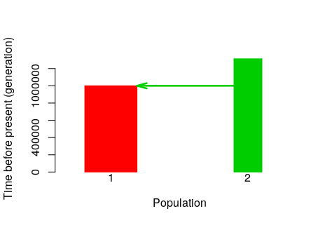
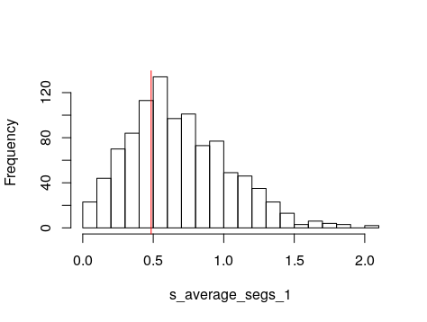

---
output:
  pdf_document: default
  word_document: default
  html_document: default
---
# Simulação e análise com PipeMaster

*tutorial traduzido do inglês por Andréia Estrela* (https://fitmypaper.wordpress.com/)
  
  Este é um tutorial de R sobre como simular dados, testar modelos e estimar parâmetros usando os pacotes em R [*PipeMaster-0.2.2*](https://github.com/gehara/PipeMaster), *abc* e *caret*. O dataset neste tutorial é o mesmo encontrado em Gehara et al *in review*, e representa 2.177 loci UCE da perereca neotropical *Dermatonotus muelleri*. Vamos trabalhar com uma parte dos dados (até 200 loci). Para mais informações sobre *Dermatonotus muelleri* ver [Gehara et al. *in review*](PipeMaster.pdf) e [Oliveira et al. 2018](https://www.researchgate.net/profile/Adrian_Garda/publication/327624820_Phylogeography_of_Muller%27s_termite_frog_suggests_the_vicariant_role_of_the_Central_Brazilian_Plateau/links/5c40f99f92851c22a37d572c/Phylogeography-of-Mullers-termite-frog-suggests-the-vicariant-role-of-the-Central-Brazilian-Plateau.pdf)
  
# Conteúdo

## 1. [Instalação](#installation)
    
## 2. [Parte Um](#first-part): construindo um modelo, calculando estatísticas sumárias e simulando dados

  2.1 [Main Menu](#main-menu)

  2.1.2 [Gene Menu](#gene-menu)

  2.1.2.1 [Mutation rate prior](#mutation-rate-prior)

  2.1.3 [Model Visualization](#model-visualization)

  2.1.4 [Ne Priors Menu](#ne-priors-menu)

  2.1.5 [Time Priors Menu](#time-priors-menu)

  2.1.6 [Conditions Menu](#condistions-menu)

  2.1.6.1 [Matrix of parameter conditions](#matrix-of-parameter-conditions)

  2.1.7 [Migration prior menu](#migration-prior-menu)

  2.2 [Generating a model from a template](#generating-a-model-from-a-template)

  2.3 [Model Object](#model-object)

  2.4 [Checking model parameters and manipulating prior values](#checking-model-parameters-and-manipulating-prior-values)
  
  2.5 [Saving and reloading a model](#saving-and-reloading-a-model)
  
  2.6 [Replicating the empirical data structure to the model](#replicating-the-empirical-data-structure-to-the-model)
  
  2.7 [Summary statistics calculation](#summary-statistics-calculation)
  
  2.8 [Simulating Data](#simulating-data)
  
## 3. [Parte Dois](#second-part): funções de visualização e gráficos
  
  3.1 [Plotting a Model](#plotting-a-model)
  
  3.2 [Visualize prior distributions](#visualize-prior-distributions)
  
  3.3 [Plotting simulations against empirical data](#plotting-simulations-against-empirical-data)
  
  3.4 [Plotting a PCA](#plotting-a-pca)

## 4. [Parte Três](#third-part): Computação Bayesiana aproximada (approximate Bayesian computation - ABC) e aprendizado de máquina supervisionado (supervised machine-learning - SML)
  
  4.1 [Approximate Bayesian computation for model inference](#approximate-bayesian-computation-for-model-inference)
  
  4.2 [Approximate Bayesian computation for parameter inference](#approximate-bayesian-computation-for-parameter-inference)

  4.3 [Supervised machine-learning analysis for model classification](#supervised machine-learning-analysis-for-model-classification)
  
------------------------------------------------------------------------------------------------------
  
# **Installation**
Instalação: PipeMaster pode ser instalado a partir do github utilizando *devtools* (para obter a versão mais atual com updates mais recentes), ou baixando e instalando a versão mais recente do meu repositório [github](github.com/gehara/PipeMaster).

**Instalação com devtools** 
Vá para o console do R, instale devtools e depois PipeMaster:  
  
  ```
  install.packages("devtools")
  devtools::install_github("gehara/PipeMaster")
  ## install  POPdemog to be able to plot your models                
  install.packages("https://github.com/YingZhou001/POPdemog/raw/master/POPdemog_1.0.3.tar.gz",
                 repos=NULL)
  
  ```

**Instalação sem devtools**
Instale todas as dependências, instale a versão mais recente de *PipeMaster* do meu github. Tudo isso pode ser feito no console do R utilizando o código abaixo. Talvez seja preciso conferir qual a versão mais recente e alterar a linha de código correspondente <PipeMaster-0.2.2.tar.gz>.

  ```

  install.packages(c("ape","abc","e1071","phyclust","PopGenome","msm","ggplot2","foreach"),
                 repos="http://cran.us.r-project.org")

  install.packages("http://github.com/gehara/PipeMaster/archive/PipeMaster-0.2.2.tar.gz",
                 repos=NULL)
  
  ## install  POPdemog to be able to plot your models                
  install.packages("https://github.com/YingZhou001/POPdemog/raw/master/POPdemog_1.0.3.tar.gz",
                 repos=NULL)

  ```
  
-------

# **First Part**
## construindo um modelo, calculando estatísticas sumárias e simulando dados
Vamos baixar dados reais para usar como exemplo. Vamos usar a função *Model Builder (main.menu function)* e construir alguns modelos. Vamos rodar algumas simulações e calcular estatísticas sumárias para os dados baixados. *PipeMaster não consegue simular dados faltantes ou gaps, de forma que sítios com "?", "N" ou "-" não são compatíveis. É permitido ter diferentes números de indivíduos por populaçao para cada locus, desde que sejam sempre mais de 2.*

Crie um novo diretório para salvar os exemplos
  
  ```
    ## install PipeMaster (see above).
    
    ### load PipeMaster
    library(PipeMaster)
    
    # see the working directory you are in
    getwd()
   
    # create a new directory to save outputs
    dir.create(paste(getwd(),"/PM_example",sep=""))
   
    # set this new folder as your working directory
    setwd(paste(getwd(),"/PM_example",sep=""))
  ```
  
Monte um modelo utilizando o Model Builder. Você será direcionado para um menu interativo. Aponte esta função a um objeto (*Is* no exemplo abaixo) para que seu modelo seja salvo no final. Vamos construir um modelo de duas populações.

  ```
    Is <- main.menu()
    > write bifurcating topology in newick format or 1 for single population:
  ```

## **Main Menu**

Começamos estabelecendo uma topologia newick de duas populações: *(1,2)*. Isso vai criar um modelo de isolamento de duas populçoes com tamanho populacional constante e sem migração. Você pode seguir as descrições do menu para adicionar parâmetros e priors ao modelo. Os numeros à direita indicam o numero de parâmetros do modelo. Este modelo tem 2 parâmetros de tamanho populacional e 1 parâmetro de divergência, ou 1 junção na direção coalescente. Vamos ficar com um modelo de 3 parâmetros por hora. Para visualizar o modelo, precisamos primeiro especificar os dados a serem simulados. Para isso, temos que acessar o **Gene Menu**.

```
  A > Number of populations to simulate      2
  B > Tree (go here to remove nodes)         (1,2)
      Number of nodes (junctions)            1
  C > Migration                              FALSE
  D > Pop size change through time           FALSE
  E > Setup Ne priors
      Population size parameters (total)     2
      current Ne parameters                  2
      ancestral Ne parameters                0
  F > Setup Migration priors
      current migration                      0
      ancestral migration parameters         0
  G > Setup time priors
      time of join parameters                1
      time of Ne change parameters           0
      time of Migration change parameters    0
  H > Conditions
  I > Gene setup
  P > Plot Model
  Q > Quit, my model is Ready!
  Model Builder>>>>
```

## **Gene Menu**

Digite **I** no menu principal **main menu** para ir para o gene menu. Para acessar o menu **gene menu** você terá que responder duas perguntas, sobre o tipo de dados e o numero de loci: *What type of data you want to simulate (sanger or genomic)?* e *how many loci?*. Vamos simular 30 loci UCE de acordo com os dados baixados. Assim, respondemos **genomic** ou somente **g** e depois **30**.

```
  Model Builder >>>>I
  What type of data to simulate (sanger or genomic)?:genomic
  how many loci to simulate? You should include all invariable locus: 200
  M > Mutation rate prior distribution:   uniform
  P > priors                           Min - Max
                                    1e-11   1e-09

  1 > number of loci
                                200

  B > Back to main menu
  >>>>
```

## **Mutation rate prior**

**No caso de dados genômicos, a taxa de mutação funciona como um hiperparâmetro**. A distribuição uniforme indica os valores mínimo *min* and máximo *max* para amostrar uma média e desvio padrão SD de todas as taxas de mutação. Ou seja, a taxa de mutação para cada um dos 30 loci será amostrada de uma distribuição normal com média e SD amostrados deste prior uniforme. Em cada iteração de simulaçao, uma nova média e SD são amostrados, e destes parâmetros são amostrados as 30 taxas de mutação. Esta distribuição normal é truncada em zero, de maneira que nem sempre terá a forma de uma distribuição normal padrão. Você pode determinar outras distribuições de onde amostrar as taxas de mutações. Todas as distribuições contempladas em R são permitidas, mas esta deve ser especificada na função de simulação (*sim.msABC.sumstat*). Este tópico será abordado mais a frente neste tutorial.


## **Model Visualization**
Agora que o tipo de dado a ser simulado está especificado, podemos visualizar o modelo digitando **P** ou **p**. PipeMaster perguntará se o modelo inclui uma mudança exponencial de tamanho. Como em nosso modelo de exemplo não há mudanças de tamanho, escolheremos a opção FALSE.

```
  Model Builder >>>>P
  exponential size change (TRUE or FALSE)? F
  
```


## **Ne Priors Menu** 

Vamos verificar os priors de Ne digitando *E* no *main menu*. Aqui você pode ver os nomes dos parâmetros e suas distribuições. PipeMaster usa por defaul distribuições uniformes com valores min e max de 100,000 e 500,000 indivĩduos, respectivamente. O nome Ne0.pop1 indica que o parâmetro é contemporâneo, por isso Ne0. Parâmetros ancestrais terão números crescentes em direção ao passado. Por exemplo,*Ne1.pop1* é o Ne ancestral após *Ne0*, *Ne2* é o Ne ancestral após *Ne1* e assim sucessivamente. Vamos alterar um dos priors. Digite **C** e siga as instruçoões do menu.  

```
  N > Ne prior distribution:               uniform
  D > Different ancestral Ne?              FALSE
  C > current Ne priors                       min, max
                    1   Ne0.pop1        1e+05       5e+05
                    2   Ne0.pop2        1e+05       5e+05

  B > Back to main menu
  >>>>C
```
Você deve especificar qual o número do parâmetro que quer alterar, e em seguida os dois parâmetros da distribuição. Como estamos usando uma distribuição uniforme, devemos estabelecer os valores min e max. Vamos alterar os valores de **Ne0.pop1** para min = 2e5, max = 1e6. Digite **B** para voltar ao menu principal **main.menu**

```
>>>C
Which parameter do you want to set up? (write the reference number from the menu): 1
Ne prior (4Nm) Ne0.pop1 min: 2e5
Ne prior (4Nm) Ne0.pop1 max: 1e6
N > Ne prior distribution:               uniform
D > Different ancestral Ne?              FALSE
C > current Ne priors                     min, max
                 1   Ne0.pop1        2e5        1e6
                 2   Ne0.pop2        1e+05      5e+05
 
B > Back to main menu
>>>>B
```
## **Time Priors Menu**

Digite **G** no **main menu** para acessar **time priors**. No menu **time prior** você pode ver todos os parâmetros relativos ao tempo. Neste exemplo há um único parâmetro de tempo, *join1_2*, que representa a junção (or divergência na direção real) entre as populações 1 e 2. O default de PipeMaster é uma distribuição uniforme com *min* and *max* de *500.000* e *1.500.000* gerações. **Tempo é medido em gerações**. Se seu organismo tem um tempo de geração diferente de 1 ano, você precisa converter o tempo de anos para gerações para poder estabelecer seu prior. Por exemplo, se quiser estabelecer uma divergência entre 100,000 e 1,000,000 anos, e seu organismo tem um tempo de geração de 4 anos, divida o tempo por 4. Seus valores min e max serão 25.000 e 250.000. Digite **B** para retornar ao menu principal.

```
  P > Time prior distribution:     uniform
      Time priors                   Min - Max
    J >  time of junctions:
                      1    join1_2    5e+05   1500000


  B > Back to Ne menu
```

## **Conditions Menu**

Digite **H** no **main menu** para acessar o **conditions menu**. Aqui você tem uma lista de parâmetros e algumas opções. Você pode utilizar as opções representadas por letras para estabelecer uma condição para seus parâmetros. por exemplo, se você quer que Ne0.pop1 seja sempre maior do que Ne0.pop2, mas os priors se sobrepõem, você pode acessar a opção **S** e criar uma condição de tamanho. Vamos tentar.

```
  Model Builder >>>> H
  size parameter               --  Ne0.pop1
  size parameter               --  Ne0.pop2


  time parameter               --  join1_2

  S > place a size condition
  T > place a time condition

  1 > see size matrix
  3 > see time matrix
  B > back to main menu
  >>>>S
```

## **Matrix of parameter conditions**

Esta matriz indica as condições dos parâmetros, onde *NA* significa ausência de condição. Vamos tentar criar uma condição. Queremos que **Ne0.pop1** seja sempre maior do que **Ne0.pop2**, então precisamos digitar **Ne0.pop1 > Ne0.pop2** conforme explicado no menu.

```
           Ne0.pop1 Ne0.pop2
  Ne0.pop1        0       NA
  Ne0.pop2       NA        0
  Write the name of 2 parameters with a logic sign inbetween ( >  or < or = ) separated by a space.
                Ex.: Ne0.pop1 < Ne0.pop2

  Ne0.pop1 > Ne0.pop2 

  size parameter               --  Ne0.pop1
  size parameter               --  Ne0.pop2


  time parameter               --  join1_2

  S > place a size condition
  T > place a time condition

  1 > see size matrix
  3 > see time matrix
  B > back to main menu
  >>>>
```

Agora você pode ver a matriz de tamanho digitando **1** no menu. Note que a matriz indica que Ne0.pop1 > Ne0.pop2.

```
  >>>>1
           Ne0.pop1 Ne0.pop2
  Ne0.pop1 "0"      ">"
  Ne0.pop2 "<"      "0"
  [1] "-----------------"
  size parameter               --  Ne0.pop1
  size parameter               --  Ne0.pop2


  time parameter               --  join1_2

  S > place a size condition
  T > place a time condition

  1 > see size matrix
  3 > see time matrix
  B > back to main menu
  >>>>
```

Agora retorne ao **main menu** e digite **Q** para sair do **Model Builder**.


## **Generating a model from a template**

Nosso modelo foi salvo no objeto **Is**. Podemos facilmente gerar outro modelo utilizando um modelo anterior como template. Vamos usar nosso modelo **Is** para construir um modelo similar, porém com fluxo gênico. Vamos chama-lo de **IM**, isolamento com migração. Iremos diretamente para o **main menu**, digitar **C** para incluir parâmetros de migração, depois digitar **y** ou **yes**.

```
  IM <- main.menu(Is)

  A > Number of populations to simulate      2
  B > Tree (go here to remove nodes)         (1,2)
      Number of nodes (junctions)            1
  C > Migration                              FALSE
  D > Pop size change through time           FALSE
  E > Setup Ne priors
      Population size parameters (total)     2
      current Ne parameters                  2
      ancestral Ne parameters                0
  F > Setup Migration priors
      current migration                      0
      ancestral migration parameters         0
  G > Setup time priors
      time of join parameters                1
      time of Ne change parameters           0
      time of Migration change parameters    0
  H > Conditions
  I > Gene setup
  P > Plot Model
  Q > Quit, my model is Ready!
  Model Builder >>>>C
----------------------------------------------
  Migration among populations (YES or NO)?: Y
  A > Number of populations to simulate      2
  B > Tree (go here to remove nodes)         (1,2)
      Number of nodes (junctions)            1
  C > Migration                              TRUE
  D > Pop size change through time           FALSE
  E > Setup Ne priors
      Population size parameters (total)     2
      current Ne parameters                  2
      ancestral Ne parameters                0
  F > Setup Migration priors
      current migration                      2
      ancestral migration parameters         0
  G > Setup time priors
      time of join parameters                1
      time of Ne change parameters           0
      time of Migration change parameters    0
  H > Conditions
  I > Gene setup
  P > Plot Model
  Q > Quit, my model is Ready!
  Model Builder >>>>
```

## **Migration prior menu**

Em opções podemos acessar o *migration menu*. A migração é medida em *4Nmij* onde *mij* é a fração de indivíduos na população *i* formada por migrantes da população *j*.

```
  M > Migration prior distribution:        uniform
  D > Different ancestral migration?          FALSE
  P > priors                           Min - Max
                      1   mig0.1_2    0.1   1
                      2   mig0.2_1    0.1   1

  B > Back to main menu
  >>>>
```

Vamos retornar ao menu principal e sair. O modelo está salvo no objeto **IM**.
  
## **Model Object** 

Digitando o nome do modelo no console R podemos ver seu conteúdo. Não é preciso saber como ler o objeto do modelo, mas pode ser útil para compreender como o pacote funciona. O índice *loci* mostra seus loci com as taxas de mutação. O índice *I* mostra a estrutura da população, com a terceira coluna indicando o número de populações, e as colunas seguintes mostrando o número de indivĩduos em cada população. O índice *flags* mostra os parâmetros do seu modelo com os respectivos priors. O índice *conds* mostra as matrizes de condição e o índice *tree* apresenta a topologia do modelo.

```
  > Is

  $loci
       [,1]      [,2] [,3]  [,4]    [,5]    [,6]
  [1,] "genomic" "bp" "200" "1e-11" "1e-09" "runif"

  $I
       [,1]      [,2] [,3] [,4] [,5]
  [1,] "genomic" "-I" "2"  NA   NA

  $flags
  $flags$n
       [,1]       [,2] [,3] [,4]    [,5]    [,6]
  [1,] "Ne0.pop1" "-n" "1"  "1e+05" "5e+05" "runif"
  [2,] "Ne0.pop2" "-n" "2"  "1e+05" "5e+05" "runif"

  $flags$ej
       [,1]      [,2]  [,3]  [,4]    [,5]      [,6]
  [1,] "join1_2" "-ej" "1 2" "5e+05" "1500000" "runif"


  $conds
  $conds$size.matrix
           Ne0.pop1 Ne0.pop2
  Ne0.pop1 "0"      ">"
  Ne0.pop2 "<"      "0"

  $conds$time.matrix
          join1_2
  join1_2       0


  $tree
  [1] "(1,2)"

  attr(,"class")
  [1] "Model"
```

## **Checking model parameters and manipulating prior values** 

Existe uma forma mais fácil de verificar os parâmetros e priors do modelo. Os priors podem ser alterados sem usar a função *main.menu*. Para ver seus prior, use *get.prior.table*. Esta função gera uma tabela com os parâmetros e priors do modelo. Você pode alterar a tabela e utiliza-la para atualizar os valores de prior do seu modelo com a função *update.priors*. Note que para isso funcionar, os parâmetros na tabela e no objeto do modelo tem que ser os mesmos.


```
  > Is.tab <- get.prior.table(model=Is)
  > Is.tab

    Parameter prior.1 prior.2 distribution
  1  Ne0.pop1   1e+05   5e+05        runif
  2  Ne0.pop2   1e+05   5e+05        runif
  3   join1_2   5e+05 1500000        runif


  > Is.tab[,2:3] <- 1000
  > Is.tab
  
       Parameter prior.1 prior.2 distribution
    1   Ne0.pop1    1000    1000        runif
    2   Ne0.pop2    1000    1000        runif
    3      join1    1000    1000        runif
  
  
  > Is2 <- update.priors(tab = Is.tab, model = Is)
  > get.prior.table(model=Is2)
  
       Parameter prior.1 prior.2 distribution
    1   Ne0.pop1    1000    1000        runif
    2   Ne0.pop2    1000    1000        runif
    3      join1    1000    1000        runif
```

## **Saving and reloading a model** 

Você pode salvar o modelo como um arquivo de texto usando *dput*. Para importar (ler) o modelo de volta ao R use *dget*.
  
```
    dput(Is, "Is.txt")
    Is <- dget("Is.txt")
```

## **Replicating the empirical data structure to the model**

Para que o modelo esteja pronto para as simulações, precisamos replicar a estrutura dos dados empíricos. Temos que estabelecer o número exato de indivíduos por população e o tamanho de cada locus. Para isso usamos a função **get.data.structure**. Esta função requer: (i) um arquivo de atribuição, um data frame de duas colunas com o nome dos indivíduos as respectivas populações a que pertencem; (ii) um objeto de modelo onde a estrutura será replicada; (iii) o caminho (localização) dos dados empíricos que serão replicados.
  
Carregue dados empíricos (sequências de DNA)

  ```
  # load the data
  data("seqs", package = "PipeMaster")

  # create a directory to save the sequences
  dir.create("fastas")
  
  # navigate to the directory
  setwd("./fastas")
  
  ##### Windows ####
  ### salva as primeiras 30 sequencias 
  for(i in 1:30){
  write.dna(seqs[[i]], file = paste("seq",i,".fas",sep="_"), format = "fasta")
  }
  ##### Windows ####
  
  ###### MAC e LINUX ######
  # essa parte salva todas as 200 sequencias (somente MAC ae Linux)
  # write the fasta alignments
  for(i in 1:length(seqs)){
    write.dna(seqs[[i]], file = paste("seq",i,".fas",sep="_"), format = "fasta")
  }
  ###### MAC e LINUX ######
  
  # go back one dir
  setwd("../")
    
  # check how any files are inside the fastas folder
  length(list.files("./fastas"))
  ```
  
Ao invés de simular os modelos que acabamos de criar, vamos simular três modelos disponíveis como exemplo no pacote. Os dados de exemplo encontrados em PipeMaster são baseados em [Gehara et al. *in review*](PipeMaster.pdf), o artigo que descreve o pacote. [**Aqui**](https://docs.google.com/spreadsheets/d/1FZonOF27VgGKiAgWQS56zZ4G5bbtz5t_-302LJQFlQA/edit?usp=sharing) você encontra uma planilha com todos os 10 modelos, respectivos parâmetros e priors. Lembre-se que você pode utiliza-los como template para sua própria análise. Você precisa somente alterar os priors como descrito anteriormente, e replicar a estrutura dos seus dados usando *get.data.structue* como explicado acima. Entre os modelos disponíveis estão *Is* e *IM* - como os que acabamos de construir porém com valores de priors diferentes - então simularemos estes. O terceiro exemplo é o modelo *IsBot2*, que é similar a *Is* porém incluindo um bottleneck para uma das populações. Vamos também carregar um exemplo de arquivo de atribuição para estes dados empíricos.
  
```
    # load the example assignment file.
    data(popassign, package="PipeMaster")
    
    # load some available models
    data(models, package="PipeMaster")

    # replicate the data structure
    Is <- get.data.structure(model = Is, 
    path.to.fasta = "./fastas", pop.assign = popassign, sanger = F)

    IM <- get.data.structure(model = IM,
    path.to.fasta = "./fastas", pop.assign = popassign, sanger = F)

    IsBot2 <- get.data.structure(model = IsBot2, 
    path.to.fasta = "./fastas", pop.assign = popassign, sanger = F) 
  
    ## !!! save the models!! ##
    dput(Is, "Is.txt")
    dput(IM, "IM.txt")
    dput(IsBot2, "IsBot2.txt")

```
  
## **Summary statistics calculations**

Para calcular as estatísticas sumárias para os dados empíricos vamos utilizar a função **obs.sumstat.ngs**. Esta função também precisa de um arquivo de atribuição e um objeto de modelo. Por default, PipeMaster calcula todas as estatísticas sumárias disponíveis, e você seleciona *a posteriori*.

```
  ###### MAC e LINUX ######
  obs <- obs.sumstat.ngs(model = Is, path.to.fasta = "./fastas", pop.assign = popassign)
  ###### MAC e LINUX ######
  
  ###### Windows #######
  # !!!! Substitua o caminho "/home/marcelo/PM_example/fastas" abaixo
  observed.sumstat(Is, path.to.fasta = "/home/marcelo/PM_example/fastas")
  obs <- read.table("./fastas/observed_popstats_mean.txt", header = T)
  ###### Windows #######
  
```
Para ver as estatísticas sumárias observadas, digite **obs**.
Para ver o nome das estatísticas sumárias use **colnames(obs)**
  
```
 > colnames(obs)
  
   [1] "s_average_segs_1"               "s_variance_segs_1"
   [3] "s_average_segs_2"               "s_variance_segs_2"
   [5] "s_average_segs"                 "s_variance_segs"
   [7] "s_average_pi_1"                 "s_variance_pi_1"
   [9] "s_average_pi_2"                 "s_variance_pi_2"
  [11] "s_average_pi"                   "s_variance_pi"
  [13] "s_average_w_1"                  "s_variance_w_1"
  [15] "s_average_w_2"                  "s_variance_w_2"
  [17] "s_average_w"                    "s_variance_w"
  [19] "s_average_tajd_1"               "s_variance_tajd_1"
  [21] "s_average_tajd_2"               "s_variance_tajd_2"
  [23] "s_average_tajd"                 "s_variance_tajd"
  [25] "s_average_ZnS_1"                "s_variance_ZnS_1"
  [27] "s_average_ZnS_2"                "s_variance_ZnS_2"
  [29] "s_average_ZnS"                  "s_variance_ZnS"
  [31] "s_average_Fst"                  "s_variance_Fst"
  [33] "s_average_shared_1_2"           "s_variance_shared_1_2"
  [35] "s_average_private_1_2"          "s_variance_private_1_2"
  [37] "s_average_fixed_dif_1_2"        "s_variance_fixed_dif_1_2"
  [39] "s_average_pairwise_fst_1_2"     "s_variance_pairwise_fst_1_2"
  [41] "s_average_fwh_1"                "s_variance_fwh_1"
  [43] "s_average_fwh_2"                "s_variance_fwh_2"
  [45] "s_average_FayWuH"               "s_variance_FayWuH"
  [47] "s_average_dvk_1"                "s_variance_dvk_1"
  [49] "s_average_dvh_1"                "s_variance_dvh_1"
  [51] "s_average_dvk_2"                "s_variance_dvk_2"
  [53] "s_average_dvh_2"                "s_variance_dvh_2"
  [55] "s_average_dvk"                  "s_variance_dvk"
  [57] "s_average_dvh"                  "s_variance_dvh"
  [59] "s_average_thomson_est_1"        "s_variance_thomson_est_1"
  [61] "s_average_thomson_est_2"        "s_variance_thomson_est_2"
  [63] "s_average_thomson_est"          "s_variance_thomson_est"
  [65] "s_average_thomson_var_1"        "s_variance_thomson_var_1"
  [67] "s_average_thomson_var_2"        "s_variance_thomson_var_2"
  [69] "s_average_thomson_var"          "s_variance_thomson_var"
  [71] "s_average_pi_1_s_average_w_1"   "s_variance_pi_1_s_variance_w_1"
  [73] "s_average_pi_2_s_average_w_2"   "s_variance_pi_2_s_variance_w_2"
  [75] "s_average_pi_s_average_w"       "s_variance_pi_s_variance_w"
```
  
Existem **76** estatísticas sumárias para estes dados, que são médias e variâncias entre loci, para cada população e no total dos dados. Vamos utilizar **grep** para selecionar as estatísticas que queremos excluir. Descrições das estatísticas sumárias podem ser encontradas no [manual msABC](https://www.dropbox.com/s/m1mkmp0xtiv2a3x/manual.pdf?dl=0)


```
####### MAC e LINUX ######
  cols <- c(grep("thomson", colnames(obs)),
              grep("pairwise_fst", colnames(obs)),
              grep("Fay", colnames(obs)),
              grep("fwh", colnames(obs)),
              grep("_dv", colnames(obs)),
              grep("_s_", colnames(obs)),
              grep("_ZnS", colnames(obs)))
            
  obs <- t(data.frame(obs[,-cols]))
 ####### MAC e Linux #####  
```
Verifique os nomes das estatísticas novamente

```
  > colnames(obs)

   [1] "s_average_segs_1"         "s_variance_segs_1"
   [3] "s_average_segs_2"         "s_variance_segs_2"
   [5] "s_average_segs"           "s_variance_segs"
   [7] "s_average_pi_1"           "s_variance_pi_1"
   [9] "s_average_pi_2"           "s_variance_pi_2"
  [11] "s_average_pi"             "s_variance_pi"
  [13] "s_average_w_1"            "s_variance_w_1"
  [15] "s_average_w_2"            "s_variance_w_2"
  [17] "s_average_w"              "s_variance_w"
  [19] "s_average_tajd_1"         "s_variance_tajd_1"
  [21] "s_average_tajd_2"         "s_variance_tajd_2"
  [23] "s_average_tajd"           "s_variance_tajd"
  [25] "s_average_ZnS"            "s_variance_ZnS"
  [27] "s_average_Fst"            "s_variance_Fst"
  [29] "s_average_shared_1_2"     "s_variance_shared_1_2"
  [31] "s_average_private_1_2"    "s_variance_private_1_2"
  [33] "s_average_fixed_dif_1_2"  "s_variance_fixed_dif_1_2"
```

Salve o resultado como uma tabela usando **write.table**.

```
  write.table(obs,"observed.txt", quote=F,col.names=T, row.names=F)
```

## **Simulating data**

Agora que temos dois modelos, **Is** e **IM**, vamos simular estatísticas sumárias. Vamos utilizar *sim.msABC.sumstat* para simular dados genômicos. Esta função funciona somente em linux e Mac. PipeMaster controla *msABC* para simular os dados. O pacote simula dados em lotes ou blocos para evitar sobrecarga de memória no R, e ao mesmo tempo otimizar o tempo gasto para registrar as simulações em arquivo.Para controlar o número total de simulações, você precisa controlar o tamanho do bloco de simulações, o número de blocos para simular, e o número de cores utilizados. O número total de simulações será = nsim.blocks *x* block.size *x* ncores. Você pode jogar com estes valores para otimizar a velocidade do processo de simulação. Um tamanho de bloco menor usara menos RAM, mas exigirá uma interação mais frequente entre o master node e os slave nodes, o que pode gastar tempo. Um tamanho de bloco maior pode sobrecarregar o R, já que R não consegue lidar bem com muita memória. Também pode ocupar muita RAM, especialmente se estiver rodando muitos cores ao mesmo tempo. PipeMaster vai mostrar uma estimativa de tempo no console, o que pode ajudar você a otimizar os parâmetros. Pela minha experiência, um block.size de 1000 funcionará bem para a maioria dos casos. Se não quiser mexer com isso, deixe em 1000 que deve dar certo.


```
  ##### MAC e LINUX ######
  sim.msABC.sumstat(Is, nsim.blocks = 1, use.alpha = F, 
  output.name = "Is", append.sims = F, block.size =   500, ncores = 2)

  sim.msABC.sumstat(IM, nsim.blocks = 1, use.alpha = F, 
  output.name = "IM", append.sims = F, block.size =   500, ncores = 2)
                    
  sim.msABC.sumstat(IsBot2, nsim.blocks = 1, use.alpha = F, 
  output.name = "IsBot2", append.sims = F, block.size =   500, ncores = 2)
  ##### MAC e LINUX ######
  

  ###### Windows ######
  sim.ms.sumstat(Is, nsim.blocks = 1, use.alpha = F,
                  output.name = "Is", append.sims = F, sim.block.size = 1000)

  sim.ms.sumstat(IM, nsim.blocks = 1, use.alpha = F,
                  output.name = "IM", append.sims = F, sim.block.size = 1000)

  sim.ms.sumstat(IsBot2, nsim.blocks = 1, use.alpha = F,
                  output.name = "IsBot2", append.sims = F, sim.block.size = 1000)
  ###### Windows ######

```

## **Mutation rate**

No PipeMaster, a taxa de mutação pode ser parametrizada de diferentes maneiras. A opção padrão é usar uma distribuição uniforme para amostrar uma *média* e *desvio padrão* para a taxa de mutação em todos os loci (taxa de mutação por locus por geração). Portanto, o PipeMaster pegará essa *média* e *SD* e gerará uma distribuição uniforme para amostrar uma taxa de mutação por loci. No entanto, uma distribuição específica para amostrar as taxas de mutação pode ser especificada como um argumento da função de simulação. Todas as distribuições disponíveis em r-base e r-package e1071 são permitidas. O argumento deve ser uma lista. O primeiro elemento da lista é o nome da função de distribuição. O segundo elemento da lista deve ser o número de loci. Os seguintes elementos são os parâmetros da distribuição a serem passados para a função de distribuição do r.

```
sim.msABC.sumstat(Is, nsim.blocks = 1, use.alpha = F, 
                  output.name = "Is", append.sims = F, block.size = 500, ncores = 20,
                  mu.rates = list("rtnorm",30, 1e-9, 0, 0))
```

## **Recombination rate**

Também é possível especificar uma distribuição para a taxa de recombinação da mesma forma. A taxa de recombinação é especificada como a probabilidade de recombinação por par de bases.

```
sim.msABC.sumstat(Is, nsim.blocks = 1, use.alpha = F, 
                  output.name = "Is", append.sims = F, block.size = 500, ncores = 2,
                  rec.rates = list("runif", 30, 1e-9, 0),
                  mu.rates = list("rtnorm",30, 1e-9, 0, 0))
                  
```                  
        
-------------------------------------------------------------------------------------------------------

# **Second Part**
# funções de visualização e gráficos

Nesta parte do tutorial, vamos ver algumas das funções de visualização do PipeMaster.

## **Plotting a model**

Existe agora uma função no PipeMaster para plotar seu modelo. Esta é uma função wrapper que irá acionar a função PlotMS do pacote POPdemog. Ela ainda não foi extensivamente testada, portanto se encontrar um bug, por favor me comunique por email (marcelo.gehara@gmail.com). 
```
PlotModel(model=Is, use.alpha = F, average.of.priors=F)
PlotModel(model=IM, use.alpha = F, average.of.priors=F)
PlotModel(model=IsBot2, use.alpha = c(T,1), average.of.priors=F)
```




## **Visualize prior distributions**

Podemos utilizar a função *plot.prior* para visualizar distribuições de priors. 
  
```
plot.priors(Is, nsamples = 1000)
```


## **Plotting simulations against empirical data**

Vamos visualizar as simulações. Importe as simulações de volta ao R. Se seu arquivo for grande (por exemplo se você tiver mais de 5E5 simulações), você deve usar o pacote bigmemory para processar os dados. Vamos também parear as estatíticas sumárias simuladas e observadas, para manter as mesmas estatísticas.

```
############ Linux MAC
Is.sim <- read.table("SIMS_Is.txt", header=T)
IM.sim <- read.table("SIMS_IM.txt", header=T)
IsBot2.sim <- read.table("SIMS_IsBot2.txt", header=T)

Is.sim <- Is.sim[,colnames(Is.sim) %in% colnames(obs)]
IM.sim <- IM.sim[,colnames(IM.sim) %in% colnames(obs)]
IsBot2.sim <- IsBot2.sim[,colnames(IsBot2.sim) %in% colnames(obs)]
############### Linux MAC

######################## windows
setwd("~/PM_example")
Is.sim <- read.table("Is_popstats_mean.txt", header=T)
IM.sim <- read.table("IM_popstats_mean.txt", header=T)
IsBot2.sim <- read.table("IsBot2_popstats_mean.txt", header=T)
####################### windows

```

Agora podemos plotar o observado contra o simulado. Isto ajuda a avaliar seu modelo e ter uma noção visual de como as simulações se encaixam nos dados observados.

```
plot.sim.obs(Is.sim, obs)
plot.sim.obs(IsBot2.sim, obs)
```


## **Plotting a PCA**

Podemos também plotar uma Principal Component Analysis das simulações contra os dados empíricos. Isto também ajuda a avaliar o enquadramento dos modelos. Primeiro combinamos os modelos em um data frame único e geraremos um índice. 

```
models <- rbind(Is.sim, IM.sim, IsBot2.sim)
index <- c(rep("Is", nrow(Is.sim)), rep("IM", nrow(IM.sim)), rep("IsBot2", nrow(IsBot2.sim)))
plotPCs(model = models, index = index, observed = obs, subsample = 1)
```


-------------------------------------------------------------------------------------

# **Third Part**
# Computação Bayesiana aproximada (approximate Bayesian computation - ABC) e aprendizado de máquina supervisionado (supervised machine-learning - SML)**

Na parte final deste tutorial, iremos realizar análise de dados usando os pacotes *PipeMaster*, *abc* e *caret*.

---

* **Esta parte do tutorial se restringe a um único caso**, você deve consultar os materiais listados abaixo caso pretenda realizar alguma destas anãlises:

* (i) A [**vignette**](https://cran.r-project.org/web/packages/abc/vignettes/abcvignette.pdf) do pacote *abc* é muito informativa e abrange o pacote inteiro.

* (ii) *caret* é um pacote muito amplo para aprendizado de máquina. Existem centenas de algorítmos disponíveis com ampla [**documentação online**](http://topepo.github.io/caret/index.html).

* (iii) [Aqui](https://www.youtube.com/watch?v=aircAruvnKk) você encontra uma série de vídeos do YouTube explicando redes neurais em maior detalhe. Parte do material usado aqui vem destes vídeos.

---

## **Approximate Bayesian computation for model inference**
*abc* é um pacote utilizado para *computação Bayesiana aproximada* e já é uma dependência de *PipeMaster*, portanto não é necessário carrega-lo. Já temos os modelos combinados em uma tabela única, o índice, e o observado, que é tudo o que precisamos para rodar uma análise de ABC. Vamos rodar a função *postpr* com algorítmo *rejection* para calcular a probabilidade de cada modelo.

```
  prob <- postpr(target = obs, sumstat = models, index = index, method = "rejection",   tol=0.1)

  summary(prob)
```

**Validação cruzada** 

É importante realizar uma validação cruzada para avaliar se os modelos são identificáveis e o quão confiantes podemos estar em nossas estimativas. Usamos a função *cv4postpr* para rodar a validação.

```
  CV <- cv4postpr(sumstat = models, index = index, method = "rejection", tol=0.1, nval = 20)

  summary(CV)

  plot(CV)
  
  # overall accuracy
  acc <- summary(CV)
  sum(diag(acc$conf.matrix$tol0.1))/60
  
```

## **Approximate Bayesian computation for parameter inference**. 

O *abc* realiza uma etapa de rejeição também para estimativas de parâmetros. Para isto vamos utilizar apenas o melhor modelo.
  
```
# read selected model
IsBot2.sim <- read.table("SIMS_IsBot2.txt", header=T)
  
# separate summary statistics from parameters
sims <- IsBot2.sim[,colnames(IsBot2.sim) %in% colnames(obs)]
param <- IsBot2.sim[,1:11]
  
# estimate posterior distribution of parameters
  
posterior <- abc(target = obs,
            param = param,
            sumstat = sims,
            method = "rejection",
            tol=0.1) 
            
            summary(posterior)
            
# write results to file
write.table(summary(posterior), "parameters_est.txt")
```   

Plot posterior distribution

```
# plotar probabilidades posteriores contra priors
  for(i in 1:ncol(param)){
    plot(density(posterior$unadj.values[,i]), col=2, main = colnames(param)[i])
    lines(density(param[,i]))
  }
```

**Validação cruzada** 

É importante realizar uma validação cruzada para avaliar se os modelos são identificáveis e o quão confiantes podemos estar em nossas estimativas. A função *cv4abc* realiza um experimento leave-one-out para avaliar a performance do método. Para fazer isso corretamente temos que utilizar o mesmo valor de tolerância e método com mesmos parâmetros utilizados acima.

```
# validação cruzada para estimativas de parâmetros
cv <- cv4abc(param = param,
              sumstat = sims,
              nval = 20,
              method = "rejection",
              tol = 0.1)
  
plot(cv)
  
```
Check the error of the estimate

```
summary(cv)
```
  

## **Supervised machine-learning analysis for model classification**. 

Vamos treinar um algorítmo de rede neural e utiliza-lo para classificar nossos dados empíricos. No artigo que descreve o pacote, [Gehara et al. *in review*](PipeMaster.pdf), eu rodei um experimento de simulação comparando algorítmos ABC rejection com SML rede neural e concluí que SML é muito mais eficiente e preciso.

Precisamos instalar e carregar o pacote *caret*. Para rodar *caret* em paralelo, precisamos carregar um pacote que controle nós para rodar loops em paralelo usando MPI. Existem vários pacotes que fazem isso. Nós utilizaremos *doMC*.

``` 
install.packages("caret")
library(caret) # caret: used to perform the superevised machine-learning (SML)

install.packages("doMC")  
library(doMC) # doMC: necessary to run the SML in parallel
``` 

Para treinar o algoritmo, precisamos dividir os dados entre treino e teste. Tipicamente se usa 75% para treino e 25% para teste. Podemos fazer isso utilizando *createDataPartition*. Também precisamos especificar nossos preditores e o resultado. Neste caso, os preditores são as estatísticas sumárias, e o resultado é o nome do modelo ou índice.

Estabelecer os parâmetros para a rede neural pode ser muito demorado, e não há uma maneira objetiva de decidir quais valores de parâmetros usar. Para ajudar a escolher valores de parâmetros, *caret* roda o treinamento várias vezes com diferentes valores de parâmetros para determinar qual combinação resulta em maior precisão na seleção de modelos. E isto é feito usando diferentes métodos de reamostragem. Você pode determinar o numero de replicações e o método de reamostragem através da função *trainControl* function.


```

  # set up number of cores for SML
  registerDoMC(1)
  
  ## combine simulations and index
  models <- cbind(models, index)
  
  ## setup the outcome (name of the models, cathegories)
  outcomeName <- 'index'
  
  ## set up predictors (summary statistics)
  predictorsNames <- names(models)[names(models) != outcomeName]
  
  ## split the data into trainning and testing sets; 75% for trainning, 25% testing
  splitIndex <- createDataPartition(models[,outcomeName], p = 0.75, list = FALSE, times = 1)
  train <- models[ splitIndex,]
  test  <- models[-splitIndex,]
  
  ## bootstraps and other controls
  objControl <- trainControl(method='boot', number=1, returnResamp='final',
                             classProbs = TRUE)
  ## train the algoritm
  nnetModel_select <- train(train[,predictorsNames], train[,outcomeName],
                            method="nnet",maxit=5000,
                            trControl=objControl,
                            metric = "Accuracy",
                            preProc = c("center", "scale"))
                            
  ## predict outcome for testing data, classification
  predictions <- predict(object=nnetModel_select, test[,predictorsNames], type='raw')
  
  ## calculate accuracy in model classification
  accu <- postResample(pred=predictions, obs=as.factor(test[,outcomeName]))
  
  ## predict probabilities of the models for the observe data
  pred <- predict(object=nnetModel_select, observed, type='prob')
  
  # visualize results
  t(c(pred,accu))
  
  # write results to file
  write.table(c(pred,accu),"results.selection.txt")
```

Visualize and write results to file

```
# visualizar resultados
t(c(pred,accu))
  
# salvar resultados em arquivo
write.table(c(pred,accu),"results.selection.txt")
```

**Codemographics**

Cheque o [manual hABC](https://github.com/gehara/PipeMaster/blob/master/hABC_manual.md) se quiser tentar uma análise codemográfica com dados de um locus por espécie

# FIM!


  
  
